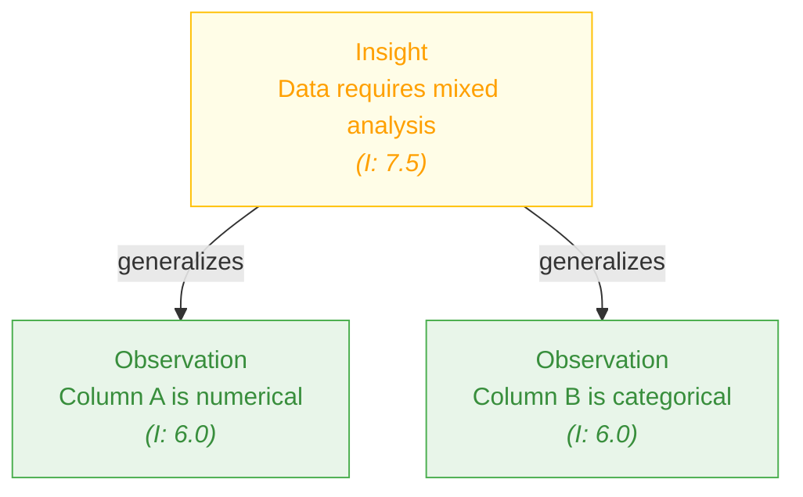

# Technical Analysis of Unified Agent Memory and Cognitive System

## System Overview and Architecture

The provided code implements a sophisticated `Unified Agent Memory and Cognitive System` designed for LLM agents. This system combines a structured memory hierarchy with process tracking, reasoning capabilities, and knowledge management. It's built as an asynchronous Python module using SQLite for persistence with sophisticated memory organization patterns.

### Core Architecture

The system implements a cognitive architecture with four distinct memory levels:

1. **Working Memory**: Temporarily active information (30-minute default TTL)
2. **Episodic Memory**: Experiences and event records (7-day default TTL)
3. **Semantic Memory**: Knowledge, facts, and insights (30-day default TTL)
4. **Procedural Memory**: Skills and procedures (90-day default TTL)

These are implemented through a SQLite database using `aiosqlite` for asynchronous operations, with optimized configuration:

```python
DEFAULT_DB_PATH = os.environ.get("AGENT_MEMORY_DB_PATH", "unified_agent_memory.db")
MAX_TEXT_LENGTH = 64000  # Maximum for text fields
CONNECTION_TIMEOUT = 10.0  # seconds
ISOLATION_LEVEL = None  # SQLite autocommit mode

# Memory management parameters
MAX_WORKING_MEMORY_SIZE = int(os.environ.get("MAX_WORKING_MEMORY_SIZE", "20"))
DEFAULT_TTL = {
    "working": 60 * 30,       # 30 minutes
    "episodic": 60 * 60 * 24 * 7, # 7 days
    "semantic": 60 * 60 * 24 * 30, # 30 days
    "procedural": 60 * 60 * 24 * 90 # 90 days
}
MEMORY_DECAY_RATE = float(os.environ.get("MEMORY_DECAY_RATE", "0.01"))  # Per hour
```

The system uses various SQLite optimizations through pragmas:

```python
SQLITE_PRAGMAS = [
    "PRAGMA journal_mode=WAL",  # Write-Ahead Logging
    "PRAGMA synchronous=NORMAL",  # Balance durability and performance
    "PRAGMA foreign_keys=ON",
    "PRAGMA temp_store=MEMORY",
    "PRAGMA cache_size=-32000",  # ~32MB cache
    "PRAGMA mmap_size=2147483647",  # Memory-mapped I/O
    "PRAGMA busy_timeout=30000"  # 30-second timeout
]
```

## Type System and Enumerations

The code defines comprehensive type hierarchies through enumerations:

### Workflow and Action Status
```python
class WorkflowStatus(str, Enum):
    ACTIVE = "active"
    PAUSED = "paused"
    COMPLETED = "completed"
    FAILED = "failed"
    ABANDONED = "abandoned"

class ActionStatus(str, Enum):
    PLANNED = "planned"
    IN_PROGRESS = "in_progress"
    COMPLETED = "completed"
    FAILED = "failed"
    SKIPPED = "skipped"
```

### Content Classification
```python
class ActionType(str, Enum):
    TOOL_USE = "tool_use"
    REASONING = "reasoning"
    PLANNING = "planning"
    RESEARCH = "research"
    ANALYSIS = "analysis"
    DECISION = "decision"
    OBSERVATION = "observation"
    REFLECTION = "reflection"
    SUMMARY = "summary"
    CONSOLIDATION = "consolidation"
    MEMORY_OPERATION = "memory_operation"

class ArtifactType(str, Enum):
    FILE = "file"
    TEXT = "text"
    IMAGE = "image"
    TABLE = "table"
    CHART = "chart"
    CODE = "code"
    DATA = "data"
    JSON = "json" 
    URL = "url"

class ThoughtType(str, Enum):
    GOAL = "goal"
    QUESTION = "question"
    HYPOTHESIS = "hypothesis"
    INFERENCE = "inference"
    EVIDENCE = "evidence"
    CONSTRAINT = "constraint"
    PLAN = "plan"
    DECISION = "decision"
    REFLECTION = "reflection"
    CRITIQUE = "critique"
    SUMMARY = "summary"
```

### Memory System Types
```python
class MemoryLevel(str, Enum):
    WORKING = "working"
    EPISODIC = "episodic"
    SEMANTIC = "semantic"
    PROCEDURAL = "procedural"

class MemoryType(str, Enum):
    OBSERVATION = "observation"
    ACTION_LOG = "action_log"
    TOOL_OUTPUT = "tool_output"
    ARTIFACT_CREATION = "artifact_creation"
    REASONING_STEP = "reasoning_step"
    FACT = "fact"
    INSIGHT = "insight"
    PLAN = "plan"
    QUESTION = "question"
    SUMMARY = "summary"
    REFLECTION = "reflection"
    SKILL = "skill"
    PROCEDURE = "procedure"
    PATTERN = "pattern"
    CODE = "code"
    JSON = "json"
    URL = "url"
    TEXT = "text"

class LinkType(str, Enum):
    RELATED = "related"
    CAUSAL = "causal"
    SEQUENTIAL = "sequential"
    HIERARCHICAL = "hierarchical"
    CONTRADICTS = "contradicts"
    SUPPORTS = "supports"
    GENERALIZES = "generalizes"
    SPECIALIZES = "specializes"
    FOLLOWS = "follows"
    PRECEDES = "precedes"
    TASK = "task"
    REFERENCES = "references"
```

## Database Schema

The system uses a sophisticated relational database schema with 15+ tables and numerous indices:

1. **workflows**: Tracks high-level workflow containers
2. **actions**: Records agent actions and tool executions
3. **artifacts**: Stores outputs and files created during workflows
4. **thought_chains**: Groups related thoughts (reasoning processes)
5. **thoughts**: Individual reasoning steps and insights
6. **memories**: Core memory storage with metadata and classification
7. **memory_links**: Associative connections between memories
8. **embeddings**: Vector embeddings for semantic search
9. **cognitive_states**: Snapshots of agent cognitive state
10. **reflections**: Meta-cognitive analysis outputs
11. **memory_operations**: Audit log of memory system operations
12. **tags, workflow_tags, action_tags, artifact_tags**: Tagging system
13. **dependencies**: Tracks dependencies between actions
14. **memory_fts**: Virtual FTS5 table for full-text search

Each table has appropriate foreign key constraints and indexes for performance optimization. The schema includes circular references between memories and thoughts, implemented with deferred constraints.

## Connection Management

The database connection is managed through a sophisticated singleton pattern:

```python
class DBConnection:
    """Context manager for database connections using aiosqlite."""

    _instance: Optional[aiosqlite.Connection] = None 
    _lock = asyncio.Lock()
    _db_path_used: Optional[str] = None
    _init_lock_timeout = 15.0  # seconds
    
    # Methods for connection management, initialization, transaction handling, etc.
```

Key features include:
- Asynchronous context manager pattern with `__aenter__` and `__aexit__`
- Lock-protected singleton initialization with timeout
- Transaction context manager with automatic commit/rollback
- Schema initialization on first connection
- Custom SQLite function registration

## Utility Functions

The system includes several utility classes and functions:

```python
def to_iso_z(ts: float) -> str:
    """Converts Unix timestamps to ISO-8601 with Z suffix."""
    # Implementation

class MemoryUtils:
    """Utility methods for memory operations."""
    
    @staticmethod
    def generate_id() -> str:
        """Generate a unique UUID V4 string for database records."""
        return str(uuid.uuid4())
    
    # Methods for serialization, validation, sequence generation, etc.
```

Additional utility methods include:
- JSON serialization with robust error handling and truncation
- SQL identifier validation to prevent injection
- Tag processing to maintain taxonomies
- Access tracking to update statistics
- Operation logging for audit trails

## Vector Embeddings and Semantic Search

The system integrates with an external embedding service:

```python
# Embedding configuration
DEFAULT_EMBEDDING_MODEL = "text-embedding-3-small"
EMBEDDING_DIMENSION = 384  # For the default model
SIMILARITY_THRESHOLD = 0.75
```

Implementation includes:
- `_store_embedding()`: Generates and stores vector embeddings with error handling
- `_find_similar_memories()`: Performs semantic search with cosine similarity and filtering
- Integration with scikit-learn for similarity calculations

## Memory Relevance Calculation

The system implements a sophisticated memory relevance scoring algorithm:

```python
def _compute_memory_relevance(importance, confidence, created_at, access_count, last_accessed):
    """Computes a relevance score based on multiple factors."""
    now = time.time()
    age_hours = (now - created_at) / 3600 if created_at else 0
    recency_factor = 1.0 / (1.0 + (now - (last_accessed or created_at)) / 86400)
    decayed_importance = max(0, importance * (1.0 - MEMORY_DECAY_RATE * age_hours))
    usage_boost = min(1.0 + (access_count / 10.0), 2.0) if access_count else 1.0
    relevance = (decayed_importance * usage_boost * confidence * recency_factor)
    return min(max(relevance, 0.0), 10.0)
```

This function factors in:
- Base importance score (1-10 scale)
- Time-based decay of importance
- Usage frequency boost
- Confidence weighting
- Recency bias


## Core Memory Operations

The system implements a comprehensive set of operations for memory management through tool functions, each designed with standardized error handling and metrics tracking via decorators (`@with_tool_metrics`, `@with_error_handling`).

### Memory Creation and Storage

The primary function for creating memories is `store_memory()`:

```python
async def store_memory(
    workflow_id: str,
    content: str,
    memory_type: str,
    memory_level: str = MemoryLevel.EPISODIC.value,
    importance: float = 5.0,
    confidence: float = 1.0,
    description: Optional[str] = None,
    reasoning: Optional[str] = None,
    source: Optional[str] = None,
    tags: Optional[List[str]] = None,
    ttl: Optional[int] = None,
    context_data: Optional[Dict[str, Any]] = None,
    generate_embedding: bool = True,
    suggest_links: bool = True,
    link_suggestion_threshold: float = SIMILARITY_THRESHOLD,
    max_suggested_links: int = 3,
    action_id: Optional[str] = None,
    thought_id: Optional[str] = None,
    artifact_id: Optional[str] = None,
    db_path: str = DEFAULT_DB_PATH
) -> Dict[str, Any]:
```

This function:
1. Validates input parameters (checking enum values, numeric ranges)
2. Generates a UUID for the memory
3. Records a timestamp
4. Establishes database connections
5. Performs existence checks for foreign keys
6. Inserts the memory record with all metadata
7. Optionally generates and stores vector embeddings for semantic search
8. Identifies and suggests semantic links to related memories
9. Updates workflow timestamps and logs the operation
10. Returns a structured result with memory details and suggested links

Key parameters include:
- `workflow_id`: Required container for the memory
- `content`: The actual memory content text
- `memory_type`: Classification (e.g., "observation", "fact", "insight")
- `memory_level`: Cognitive level (e.g., "episodic", "semantic")
- `importance`/`confidence`: Scoring for relevance calculations (1.0-10.0/0.0-1.0)
- `generate_embedding`: Whether to create vector embeddings for semantic search
- `suggest_links`: Whether to automatically find related memories

Memory creation automatically handles:
- Tag normalization and storage
- TTL determination (using defaults if not specified)
- Importance and confidence validation
- Creation of bidirectional links to similar memories

### Memory Retrieval and Search

The system offers multiple retrieval mechanisms:

#### Direct Retrieval by ID

```python
async def get_memory_by_id(
    memory_id: str,
    include_links: bool = True,
    include_context: bool = True,
    context_limit: int = 5,
    db_path: str = DEFAULT_DB_PATH
) -> Dict[str, Any]:
```

This function:
1. Fetches specific memory by ID
2. Updates access statistics
3. Optionally includes outgoing and incoming links
4. Optionally includes semantically similar memories as context
5. Checks TTL expiration

#### Keyword/Criteria-Based Search

```python
async def query_memories(
    workflow_id: Optional[str] = None,
    memory_level: Optional[str] = None,
    memory_type: Optional[str] = None,
    search_text: Optional[str] = None,
    tags: Optional[List[str]] = None,
    min_importance: Optional[float] = None,
    max_importance: Optional[float] = None,
    min_confidence: Optional[float] = None,
    min_created_at_unix: Optional[int] = None,
    max_created_at_unix: Optional[int] = None,
    sort_by: str = "relevance",
    sort_order: str = "DESC",
    include_content: bool = True,
    include_links: bool = False,
    link_direction: str = "outgoing",
    limit: int = 10,
    offset: int = 0,
    db_path: str = DEFAULT_DB_PATH
) -> Dict[str, Any]:
```

This function provides powerful filtering capabilities:
- Workflow, level, type filters
- Full-text search via SQLite FTS5
- Tag filtering with array containment
- Importance/confidence ranges
- Creation time ranges
- Custom sorting options (relevance, importance, created_at, updated_at, etc.)
- Pagination via limit/offset
- Link inclusion options

#### Semantic/Vector Search

```python
async def search_semantic_memories(
    query: str,
    workflow_id: Optional[str] = None,
    limit: int = 5,
    threshold: float = SIMILARITY_THRESHOLD,
    memory_level: Optional[str] = None,
    memory_type: Optional[str] = None,
    include_content: bool = True,
    db_path: str = DEFAULT_DB_PATH
) -> Dict[str, Any]:
```

This implements vector similarity search:
1. Generates embeddings for the query
2. Finds memories with similar embeddings using cosine similarity
3. Applies threshold and filters
4. Updates access statistics for retrieved memories

#### Hybrid Search (Keyword + Vector)

```python
async def hybrid_search_memories(
    query: str,
    workflow_id: Optional[str] = None,
    limit: int = 10,
    offset: int = 0,
    semantic_weight: float = 0.6,
    keyword_weight: float = 0.4,
    memory_level: Optional[str] = None,
    memory_type: Optional[str] = None,
    tags: Optional[List[str]] = None,
    min_importance: Optional[float] = None,
    max_importance: Optional[float] = None,
    min_confidence: Optional[float] = None,
    min_created_at_unix: Optional[int] = None,
    max_created_at_unix: Optional[int] = None,
    include_content: bool = True,
    include_links: bool = False,
    link_direction: str = "outgoing",
    db_path: str = DEFAULT_DB_PATH
) -> Dict[str, Any]:
```

This sophisticated search function:
1. Combines semantic and keyword search results
2. Normalizes and weights scores from both approaches
3. Applies comprehensive filtering options
4. Performs efficient batched database operations for large result sets
5. Returns hybrid-scored results with detailed metadata

### Memory Updating and Maintenance

```python
async def update_memory(
    memory_id: str,
    content: Optional[str] = None,
    importance: Optional[float] = None,
    confidence: Optional[float] = None,
    description: Optional[str] = None,
    reasoning: Optional[str] = None,
    tags: Optional[List[str]] = None,
    ttl: Optional[int] = None,
    memory_level: Optional[str] = None,
    regenerate_embedding: bool = False,
    db_path: str = DEFAULT_DB_PATH
) -> Dict[str, Any]:
```

This function allows updating memory attributes:
1. Dynamically builds SQL UPDATE clauses for changed fields
2. Optionally regenerates embeddings when content changes
3. Maintains timestamps and history
4. Returns detailed update information

```python
async def delete_expired_memories(db_path: str = DEFAULT_DB_PATH) -> Dict[str, Any]:
```

This maintenance function:
1. Identifies memories that have reached their TTL
2. Removes them in efficient batches
3. Handles cascading deletions via foreign key constraints
4. Logs operations for each affected workflow

### Memory Linking and Relationships

```python
async def create_memory_link(
    source_memory_id: str,
    target_memory_id: str,
    link_type: str,
    strength: float = 1.0,
    description: Optional[str] = None,
    db_path: str = DEFAULT_DB_PATH
) -> Dict[str, Any]:
```

This function creates directional associations between memories:
1. Prevents self-linking
2. Validates link types against `LinkType` enum
3. Ensures link strength is in valid range (0.0-1.0)
4. Uses UPSERT pattern for idempotency
5. Returns link details

```python
async def get_linked_memories(
    memory_id: str,
    direction: str = "both",
    link_type: Optional[str] = None,
    limit: int = 10,
    include_memory_details: bool = True,
    db_path: str = DEFAULT_DB_PATH
) -> Dict[str, Any]:
```

This retrieval function:
1. Gets outgoing and/or incoming links
2. Optionally filters by link type
3. Includes detailed information about linked memories
4. Updates access statistics
5. Returns structured link information

## Thought Chains and Reasoning

The system implements a sophisticated thought chain mechanism for tracking reasoning:

### Thought Chain Creation and Management

```python
async def create_thought_chain(
    workflow_id: str,
    title: str,
    initial_thought: Optional[str] = None,
    initial_thought_type: str = "goal",
    db_path: str = DEFAULT_DB_PATH
) -> Dict[str, Any]:
```

This function:
1. Creates a container for related thoughts
2. Optionally adds an initial thought (goal, hypothesis, etc.)
3. Ensures atomicity through transaction management
4. Returns chain details with ID and creation timestamp

```python
async def record_thought(
    workflow_id: str,
    content: str,
    thought_type: str = "inference",
    thought_chain_id: Optional[str] = None,
    parent_thought_id: Optional[str] = None,
    relevant_action_id: Optional[str] = None,
    relevant_artifact_id: Optional[str] = None,
    relevant_memory_id: Optional[str] = None,
    db_path: str = DEFAULT_DB_PATH,
    conn: Optional[aiosqlite.Connection] = None
) -> Dict[str, Any]:
```

This function records individual reasoning steps:
1. Validates thought type against `ThoughtType` enum
2. Handles complex foreign key relationships
3. Automatically determines target thought chain if not specified
4. Manages parent-child relationships for hierarchical reasoning
5. Creates links to related actions, artifacts, and memories
6. Automatically creates semantic memory entries for important thoughts
7. Supports transaction nesting through optional connection parameter

```python
async def get_thought_chain(
    thought_chain_id: str,
    include_thoughts: bool = True,
    db_path: str = DEFAULT_DB_PATH
) -> Dict[str, Any]:
```

This retrieval function:
1. Fetches chain metadata
2. Optionally includes all thoughts in sequence
3. Returns formatted timestamps and structured data

### Thought Chain Visualization

```python
async def visualize_reasoning_chain(
    thought_chain_id: str,
    output_format: str = "mermaid",
    db_path: str = DEFAULT_DB_PATH
) -> Dict[str, Any]:
```

This function generates visualizations:
1. Retrieves the complete thought chain
2. For Mermaid format:
   - Generates a directed graph representation
   - Creates node definitions with appropriate shapes based on thought types
   - Handles parent-child relationships with connections
   - Adds external links to related entities
   - Implements CSS styling for different thought types
3. For JSON format:
   - Creates a hierarchical tree structure
   - Maps parent-child relationships
   - Includes all metadata
4. Returns the visualization content in the requested format

The Mermaid generation happens through a helper function `_generate_thought_chain_mermaid()` that constructs a detailed graph with styling:

```python
async def _generate_thought_chain_mermaid(thought_chain: Dict[str, Any]) -> str:
    # Implementation creates a complex Mermaid diagram with:
    # - Header node for the chain
    # - Nodes for each thought with type-specific styling
    # - Parent-child connections
    # - External links to actions, artifacts, memories
    # - Comprehensive styling definitions
```

## Working Memory Management

The system implements sophisticated working memory with capacity management:

### Working Memory Operations

```python
async def get_working_memory(
    context_id: str,
    include_content: bool = True,
    include_links: bool = True,
    db_path: str = DEFAULT_DB_PATH
) -> Dict[str, Any]:
```

This function:
1. Retrieves the current active memory set for a context
2. Updates access statistics
3. Optionally includes memory content
4. Optionally includes links between memories
5. Returns a structured view of working memory

```python
async def focus_memory(
    memory_id: str,
    context_id: str,
    add_to_working: bool = True,
    db_path: str = DEFAULT_DB_PATH
) -> Dict[str, Any]:
```

This function:
1. Sets a specific memory as the current focus of attention
2. Optionally adds the memory to working memory if not present
3. Ensures memory and context workflow consistency
4. Updates cognitive state records
5. Returns focus update confirmation

```python
async def _add_to_active_memories(conn: aiosqlite.Connection, context_id: str, memory_id: str) -> bool:
```

This internal helper function implements working memory capacity management:
1. Checks if memory is already in working memory
2. Enforces the `MAX_WORKING_MEMORY_SIZE` limit
3. When capacity is reached, computes relevance scores for all memories
4. Removes least relevant memory to make space
5. Returns success/failure status

```python
async def optimize_working_memory(
    context_id: str,
    target_size: int = MAX_WORKING_MEMORY_SIZE,
    strategy: str = "balanced",
    db_path: str = DEFAULT_DB_PATH
) -> Dict[str, Any]:
```

This function performs optimization:
1. Implements multiple strategies:
   - `balanced`: Considers all relevance factors
   - `importance`: Prioritizes importance scores
   - `recency`: Prioritizes recently accessed memories
   - `diversity`: Ensures variety of memory types
2. Scores memories based on strategy
3. Selects optimal subset to retain
4. Updates the cognitive state
5. Returns detailed optimization results

```python
async def auto_update_focus(
    context_id: str,
    recent_actions_count: int = 3,
    db_path: str = DEFAULT_DB_PATH
) -> Dict[str, Any]:
```

This function implements automatic attention shifting:
1. Analyzes memories currently in working memory
2. Scores them based on relevance and recent activity
3. Uses the `_calculate_focus_score()` helper with sophisticated heuristics
4. Updates focus to the highest-scoring memory
5. Returns details of the focus shift

The focus scoring implements multiple weight factors:

```python
def _calculate_focus_score(memory: Dict, recent_action_ids: List[str], now_unix: int) -> float:
    """Calculate focus priority score based on multiple factors."""
    score = 0.0
    
    # Base relevance (importance, confidence, recency, usage)
    relevance = _compute_memory_relevance(...)
    score += relevance * 0.6  # Heavily weighted
    
    # Boost for recent action relationship
    if memory.get("action_id") in recent_action_ids:
        score += 3.0  # Significant boost
    
    # Type-based boosts for attention-worthy types
    if memory.get("memory_type") in ["question", "plan", "insight"]:
        score += 1.5
    
    # Memory level boosts
    if memory.get("memory_level") == MemoryLevel.SEMANTIC.value:
        score += 0.5
    elif memory.get("memory_level") == MemoryLevel.PROCEDURAL.value:
        score += 0.7
        
    return max(0.0, score)
```

## Cognitive State Management

The system implements cognitive state persistence for context restoration:

```python
async def save_cognitive_state(
    workflow_id: str,
    title: str,
    working_memory_ids: List[str],
    focus_area_ids: Optional[List[str]] = None,
    context_action_ids: Optional[List[str]] = None,
    current_goal_thought_ids: Optional[List[str]] = None,
    db_path: str = DEFAULT_DB_PATH
) -> Dict[str, Any]:
```

This function:
1. Validates that all provided IDs exist and belong to the workflow
2. Marks previous states as not latest
3. Serializes state components
4. Records a timestamped cognitive state snapshot
5. Returns confirmation with state ID

```python
async def load_cognitive_state(
    workflow_id: str,
    state_id: Optional[str] = None,
    db_path: str = DEFAULT_DB_PATH
) -> Dict[str, Any]:
```

This function:
1. Loads either a specific state or the latest state
2. Deserializes state components
3. Logs the operation
4. Returns full state details

```python
async def get_workflow_context(
    workflow_id: str,
    recent_actions_limit: int = 10,
    important_memories_limit: int = 5,
    key_thoughts_limit: int = 5,
    db_path: str = DEFAULT_DB_PATH
) -> Dict[str, Any]:
```

This function builds a comprehensive context summary:
1. Fetches workflow metadata (title, goal, status)
2. Gets latest cognitive state
3. Retrieves recent actions
4. Includes important memories
5. Adds key thoughts (goals, decisions, reflections)
6. Returns a structured context overview

## Action and Artifact Tracking

The system tracks all agent actions and created artifacts:

### Action Management

```python
async def record_action_start(
    workflow_id: str,
    action_type: str,
    reasoning: str,
    tool_name: Optional[str] = None,
    tool_args: Optional[Dict[str, Any]] = None,
    title: Optional[str] = None,
    parent_action_id: Optional[str] = None,
    tags: Optional[List[str]] = None,
    related_thought_id: Optional[str] = None,
    db_path: str = DEFAULT_DB_PATH
) -> Dict[str, Any]:
```

This function:
1. Validates action type against `ActionType` enum
2. Requires reasoning explanation
3. Validates references to workflow, parent action, and related thought
4. Auto-generates title if not provided
5. Creates a corresponding episodic memory entry
6. Returns action details with ID and start time

```python
async def record_action_completion(
    action_id: str,
    status: str = "completed",
    tool_result: Optional[Any] = None,
    summary: Optional[str] = None,
    conclusion_thought: Optional[str] = None,
    conclusion_thought_type: str = "inference",
    db_path: str = DEFAULT_DB_PATH
) -> Dict[str, Any]:
```

This function:
1. Validates completion status (completed, failed, skipped)
2. Records tool execution result
3. Updates the action record
4. Optionally adds a concluding thought
5. Updates the linked episodic memory with outcome
6. Returns completion confirmation

```python
async def get_action_details(
    action_id: Optional[str] = None,
    action_ids: Optional[List[str]] = None,
    include_dependencies: bool = False,
    db_path: str = DEFAULT_DB_PATH
) -> Dict[str, Any]:
```

This function:
1. Retrieves details for one or more actions
2. Deserializes tool args and results
3. Includes associated tags
4. Optionally includes dependency relationships
5. Returns comprehensive action information

```python
async def get_recent_actions(
    workflow_id: str,
    limit: int = 5,
    action_type: Optional[str] = None,
    status: Optional[str] = None,
    include_tool_results: bool = True,
    include_reasoning: bool = True,
    db_path: str = DEFAULT_DB_PATH
) -> Dict[str, Any]:
```

This function:
1. Gets the most recent actions for a workflow
2. Applies type and status filters
3. Controls inclusion of potentially large fields (tool results, reasoning)
4. Returns a time-ordered action list

### Action Dependencies

```python
async def add_action_dependency(
    source_action_id: str,
    target_action_id: str,
    dependency_type: str = "requires",
    db_path: str = DEFAULT_DB_PATH
) -> Dict[str, Any]:
```

This function:
1. Creates an explicit dependency relationship between actions
2. Ensures actions belong to the same workflow
3. Handles duplicate dependency declarations
4. Returns dependency details

```python
async def get_action_dependencies(
    action_id: str,
    direction: str = "downstream",
    dependency_type: Optional[str] = None,
    include_details: bool = False,
    db_path: str = DEFAULT_DB_PATH
) -> Dict[str, Any]:
```

This function:
1. Retrieves actions that depend on this one (downstream) or
2. Retrieves actions this one depends on (upstream)
3. Optionally filters by dependency type
4. Optionally includes full action details
5. Returns structured dependency information

### Artifact Management

```python
async def record_artifact(
    workflow_id: str,
    name: str,
    artifact_type: str,
    action_id: Optional[str] = None,
    description: Optional[str] = None,
    path: Optional[str] = None,
    content: Optional[str] = None,
    metadata: Optional[Dict[str, Any]] = None,
    is_output: bool = False,
    tags: Optional[List[str]] = None,
    db_path: str = DEFAULT_DB_PATH
) -> Dict[str, Any]:
```

This function:
1. Validates artifact type against `ArtifactType` enum
2. Handles content truncation for large text artifacts
3. Creates a corresponding episodic memory entry
4. Records relationships to creating action
5. Applies tags and metadata
6. Returns artifact details with ID

```python
async def get_artifacts(
    workflow_id: str,
    artifact_type: Optional[str] = None,
    tag: Optional[str] = None,
    is_output: Optional[bool] = None,
    include_content: bool = False,
    limit: int = 10,
    db_path: str = DEFAULT_DB_PATH
) -> Dict[str, Any]:
```

This function:
1. Lists artifacts for a workflow with filtering
2. Controls inclusion of potentially large content
3. Deserializes metadata
4. Returns artifact list with details

```python
async def get_artifact_by_id(
    artifact_id: str,
    include_content: bool = True,
    db_path: str = DEFAULT_DB_PATH
) -> Dict[str, Any]:
```

This function:
1. Retrieves a specific artifact by ID
2. Updates access stats for related memory
3. Returns complete artifact details

## Meta-Cognitive Capabilities

The system implements sophisticated meta-cognitive functions:

### Memory Consolidation

```python
async def consolidate_memories(
    workflow_id: Optional[str] = None,
    target_memories: Optional[List[str]] = None,
    consolidation_type: str = "summary",
    query_filter: Optional[Dict[str, Any]] = None,
    max_source_memories: int = 20,
    prompt_override: Optional[str] = None,
    provider: str = LLMGatewayProvider.OPENAI.value,
    model: Optional[str] = None,
    store_result: bool = True,
    store_as_level: str = MemoryLevel.SEMANTIC.value,
    store_as_type: Optional[str] = None,
    max_tokens: int = 1000,
    db_path: str = DEFAULT_DB_PATH
) -> Dict[str, Any]:
```

This function implements memory consolidation:
1. Allows selecting source memories:
   - Explicit memory ID list or
   - Query-based filtering or
   - Recent important memories from workflow
2. Supports multiple consolidation types:
   - `summary`: Comprehensive integration of information
   - `insight`: Pattern recognition and implications
   - `procedural`: Generalized steps or methods
   - `question`: Key information gaps or uncertainties
3. Generates LLM prompts with detailed instructions
4. Makes external LLM API calls to process memories
5. Automatically stores the result as a new memory
6. Creates bidirectional links to source memories
7. Returns consolidated content and details

The consolidation prompt generation is handled by `_generate_consolidation_prompt()`:

```python
def _generate_consolidation_prompt(memories: List[Dict], consolidation_type: str) -> str:
    # Formats memory details with truncation
    # Adds type-specific instruction templates:
    # - summary: comprehensive integration
    # - insight: pattern identification
    # - procedural: generalized methods
    # - question: information gaps
```

### Reflection Generation

```python
async def generate_reflection(
    workflow_id: str,
    reflection_type: str = "summary",
    recent_ops_limit: int = 30,
    provider: str = LLMGatewayProvider.OPENAI.value,
    model: Optional[str] = None,
    max_tokens: int = 1000,
    db_path: str = DEFAULT_DB_PATH
) -> Dict[str, Any]:
```

This meta-cognitive function:
1. Analyzes recent memory operations (from the operation log)
2. Supports multiple reflection types:
   - `summary`: Overview of recent activity
   - `progress`: Analysis of goal advancement
   - `gaps`: Knowledge and understanding deficits
   - `strengths`: Effective patterns and insights
   - `plan`: Strategic next steps
3. Generates sophisticated prompts using `_generate_reflection_prompt()`
4. Makes external LLM calls to perform analysis
5. Stores the reflection in the reflection table
6. Returns reflection content and metadata

### Memory Promotion and Evolution

```python
async def promote_memory_level(
    memory_id: str,
    target_level: Optional[str] = None,
    min_access_count_episodic: int = 5,
    min_confidence_episodic: float = 0.8,
    min_access_count_semantic: int = 10,
    min_confidence_semantic: float = 0.9,
    db_path: str = DEFAULT_DB_PATH
) -> Dict[str, Any]:
```

This function implements memory evolution:
1. Checks if a memory meets criteria for promotion to a higher level
2. Implements promotion paths:
   - Episodic → Semantic (experiences to knowledge)
   - Semantic → Procedural (knowledge to skills, with type constraints)
3. Applies configurable criteria based on:
   - Access frequency (demonstrates importance)
   - Confidence level (demonstrates reliability)
   - Memory type (suitability for procedural level)
4. Updates the memory level if criteria are met
5. Returns promotion status with reason

### Text Summarization

```python
async def summarize_text(
    text_to_summarize: str,
    target_tokens: int = 500,
    prompt_template: Optional[str] = None,
    provider: str = "openai",
    model: Optional[str] = None,
    workflow_id: Optional[str] = None,
    record_summary: bool = False,
    db_path: str = DEFAULT_DB_PATH
) -> Dict[str, Any]:
```

This utility function:
1. Summarizes text content using LLM
2. Uses configurable prompt templates
3. Controls summary length via token targeting
4. Optionally stores summary as memory
5. Returns summary text and metadata

### Context Summarization

```python
async def summarize_context_block(
    text_to_summarize: str,
    target_tokens: int = 500,
    context_type: str = "actions",
    workflow_id: Optional[str] = None,
    provider: str = LLMGatewayProvider.ANTHROPIC.value,
    model: Optional[str] = "claude-3-5-haiku-20241022",
    db_path: str = DEFAULT_DB_PATH
) -> Dict[str, Any]:
```

This specialized function:
1. Summarizes specific types of context (actions, memories, thoughts)
2. Uses custom prompts optimized for each context type
3. Designed for agent context window management
4. Returns focused summaries with compression ratio

## Reporting and Visualization

The system implements sophisticated reporting capabilities:

```python
async def generate_workflow_report(
    workflow_id: str,
    report_format: str = "markdown",
    include_details: bool = True,
    include_thoughts: bool = True,
    include_artifacts: bool = True,
    style: Optional[str] = "professional",
    db_path: str = DEFAULT_DB_PATH
) -> Dict[str, Any]:
```

This function creates comprehensive reports:
1. Fetches complete workflow details
2. Supports multiple formats:
   - `markdown`: Text-based structured report
   - `html`: Web-viewable report with CSS
   - `json`: Machine-readable structured data
   - `mermaid`: Diagrammatic representation
3. Implements multiple styling options:
   - `professional`: Formal business report style
   - `concise`: Brief summary focused on key points
   - `narrative`: Story-like descriptive format
   - `technical`: Data-oriented technical format
4. Uses helper functions for specific formats:
   - `_generate_professional_report()`
   - `_generate_concise_report()`
   - `_generate_narrative_report()`
   - `_generate_technical_report()`
   - `_generate_mermaid_diagram()`
5. Returns report content with metadata

Memory network visualization is implemented through:

```python
async def visualize_memory_network(
    workflow_id: Optional[str] = None,
    center_memory_id: Optional[str] = None,
    depth: int = 1,
    max_nodes: int = 30,
    memory_level: Optional[str] = None,
    memory_type: Optional[str] = None,
    output_format: str = "mermaid",
    db_path: str = DEFAULT_DB_PATH
) -> Dict[str, Any]:
```

This function:
1. Creates a visual representation of memory relationships
2. Supports workflow-wide view or centered on specific memory
3. Uses breadth-first search to explore links to depth limit
4. Applies memory type and level filters
5. Generates Mermaid diagram with:
   - Nodes styled by memory level
   - Links showing relationship types
   - Center node highlighting
6. Returns complete diagram code

# Detailed Key Tool Functions (Additional Core Functionality)

Below I'll cover several more important tool functions in detail that implement key functionality:

## LLM Integration

The system integrates with external LLM providers through the `llm_gateway` module:

```python
from llm_gateway.constants import Provider as LLMGatewayProvider
from llm_gateway.core.providers.base import get_provider
```

This enables:
1. Dynamic provider selection (OpenAI, Anthropic, etc.)
2. Model specification
3. Standardized prompting
4. Response handling

Example LLM integration in consolidation:

```python
provider_instance = await get_provider(provider)
llm_result = await provider_instance.generate_completion(
    prompt=prompt, model=model_to_use, max_tokens=max_tokens, temperature=0.7
)
reflection_content = llm_result.text.strip()
```

## System Statistics and Metrics

```python
async def compute_memory_statistics(
    workflow_id: Optional[str] = None,
    db_path: str = DEFAULT_DB_PATH
) -> Dict[str, Any]:
```

This function:
1. Computes comprehensive system statistics
2. Supports global or workflow-specific scope
3. Collects metrics on:
   - Total memory counts
   - Distribution by level and type
   - Confidence and importance averages
   - Temporal metrics (newest/oldest)
   - Link statistics by type
   - Tag frequencies
   - Workflow statuses
4. Returns structured statistical data

## Workflow Listing and Management

```python
async def list_workflows(
    status: Optional[str] = None,
    tag: Optional[str] = None,
    after_date: Optional[str] = None,
    before_date: Optional[str] = None,
    limit: int = 10,
    offset: int = 0,
    db_path: str = DEFAULT_DB_PATH
) -> Dict[str, Any]:
```

This function:
1. Lists workflows with filtering options
2. Supports status, tag, and date range filters
3. Includes pagination
4. Returns workflow list with counts

```python
async def create_workflow(
    title: str,
    description: Optional[str] = None,
    goal: Optional[str] = None,
    tags: Optional[List[str]] = None,
    metadata: Optional[Dict[str, Any]] = None,
    parent_workflow_id: Optional[str] = None,
    db_path: str = DEFAULT_DB_PATH
) -> Dict[str, Any]:
```

This function:
1. Creates a new workflow container
2. Creates default thought chain
3. Adds initial goal thought if provided
4. Supports workflow hierarchies via parent reference
5. Returns workflow details with IDs

```python
async def update_workflow_status(
    workflow_id: str,
    status: str,
    completion_message: Optional[str] = None,
    update_tags: Optional[List[str]] = None,
    db_path: str = DEFAULT_DB_PATH
) -> Dict[str, Any]:
```

This function:
1. Updates workflow status (active, paused, completed, failed, abandoned)
2. Adds completion thought for terminal statuses
3. Updates tags
4. Returns status update confirmation


## Database Schema Details and Implementation

The system's database schema represents a sophisticated cognitive architecture designed for tracking agent workflows, actions, thoughts, and memories. Let's examine its detailed structure:

### Schema Creation and Initialization

The schema is defined in the `SCHEMA_SQL` constant, which contains all DDL statements. The system uses a transactional approach to schema initialization:

```python
# Initialize schema if needed
cursor = await conn.execute("SELECT name FROM sqlite_master WHERE type='table' AND name='workflows'")
table_exists = await cursor.fetchone()
await cursor.close()
if not table_exists:
    logger.info("Database schema not found. Initializing...", emoji_key="gear")
    await conn.execute("PRAGMA foreign_keys = ON;")
    await conn.executescript(SCHEMA_SQL)
    logger.success("Database schema initialized successfully.", emoji_key="white_check_mark")
```

The schema includes several critical components:

### Base Tables

1. **`workflows`**: The top-level container
   ```sql
   CREATE TABLE IF NOT EXISTS workflows (
       workflow_id TEXT PRIMARY KEY,
       title TEXT NOT NULL,
       description TEXT,
       goal TEXT,
       status TEXT NOT NULL,
       created_at INTEGER NOT NULL,
       updated_at INTEGER NOT NULL,
       completed_at INTEGER,
       parent_workflow_id TEXT,
       metadata TEXT,
       last_active INTEGER
   );
   ```

2. **`actions`**: Records of agent activities
   ```sql
   CREATE TABLE IF NOT EXISTS actions (
       action_id TEXT PRIMARY KEY,
       workflow_id TEXT NOT NULL,
       parent_action_id TEXT,
       action_type TEXT NOT NULL,
       title TEXT,
       reasoning TEXT,
       tool_name TEXT,
       tool_args TEXT,
       tool_result TEXT,
       status TEXT NOT NULL,
       started_at INTEGER NOT NULL,
       completed_at INTEGER,
       sequence_number INTEGER,
       FOREIGN KEY (workflow_id) REFERENCES workflows(workflow_id) ON DELETE CASCADE,
       FOREIGN KEY (parent_action_id) REFERENCES actions(action_id) ON DELETE SET NULL
   );
   ```

3. **`artifacts`**: Outputs and files created during workflows
   ```sql
   CREATE TABLE IF NOT EXISTS artifacts (
       artifact_id TEXT PRIMARY KEY,
       workflow_id TEXT NOT NULL,
       action_id TEXT,
       artifact_type TEXT NOT NULL,
       name TEXT NOT NULL,
       description TEXT,
       path TEXT,
       content TEXT,
       metadata TEXT,
       created_at INTEGER NOT NULL,
       is_output BOOLEAN DEFAULT FALSE,
       FOREIGN KEY (workflow_id) REFERENCES workflows(workflow_id) ON DELETE CASCADE,
       FOREIGN KEY (action_id) REFERENCES actions(action_id) ON DELETE SET NULL
   );
   ```

4. **`memories`**: Core memory storage
   ```sql
   CREATE TABLE IF NOT EXISTS memories (
       memory_id TEXT PRIMARY KEY,
       workflow_id TEXT NOT NULL,
       content TEXT NOT NULL,
       memory_level TEXT NOT NULL,
       memory_type TEXT NOT NULL,
       importance REAL DEFAULT 5.0,
       confidence REAL DEFAULT 1.0,
       description TEXT,
       reasoning TEXT,
       source TEXT,
       context TEXT,
       tags TEXT,
       created_at INTEGER NOT NULL,
       updated_at INTEGER NOT NULL,
       last_accessed INTEGER,
       access_count INTEGER DEFAULT 0,
       ttl INTEGER DEFAULT 0,
       embedding_id TEXT,
       action_id TEXT,
       thought_id TEXT,
       artifact_id TEXT,
       FOREIGN KEY (workflow_id) REFERENCES workflows(workflow_id) ON DELETE CASCADE,
       FOREIGN KEY (embedding_id) REFERENCES embeddings(id) ON DELETE SET NULL,
       FOREIGN KEY (action_id) REFERENCES actions(action_id) ON DELETE SET NULL,
       FOREIGN KEY (artifact_id) REFERENCES artifacts(artifact_id) ON DELETE SET NULL
   );
   ```

5. **`thought_chains`** and **`thoughts`**: Reasoning structure
   ```sql
   CREATE TABLE IF NOT EXISTS thought_chains (
       thought_chain_id TEXT PRIMARY KEY,
       workflow_id TEXT NOT NULL,
       action_id TEXT,
       title TEXT NOT NULL,
       created_at INTEGER NOT NULL,
       FOREIGN KEY (workflow_id) REFERENCES workflows(workflow_id) ON DELETE CASCADE,
       FOREIGN KEY (action_id) REFERENCES actions(action_id) ON DELETE SET NULL
   );

   CREATE TABLE IF NOT EXISTS thoughts (
       thought_id TEXT PRIMARY KEY,
       thought_chain_id TEXT NOT NULL,
       parent_thought_id TEXT,
       thought_type TEXT NOT NULL,
       content TEXT NOT NULL,
       sequence_number INTEGER NOT NULL,
       created_at INTEGER NOT NULL,
       relevant_action_id TEXT,
       relevant_artifact_id TEXT,
       relevant_memory_id TEXT,
       FOREIGN KEY (thought_chain_id) REFERENCES thought_chains(thought_chain_id) ON DELETE CASCADE,
       FOREIGN KEY (parent_thought_id) REFERENCES thoughts(thought_id) ON DELETE SET NULL,
       FOREIGN KEY (relevant_action_id) REFERENCES actions(action_id) ON DELETE SET NULL,
       FOREIGN KEY (relevant_artifact_id) REFERENCES artifacts(artifact_id) ON DELETE SET NULL
   );
   ```

### Advanced Features

1. **Circular Foreign Key Constraints**: The schema implements circular references between memories and thoughts using deferred constraints:

   ```sql
   -- Deferrable Circular Foreign Key Constraints for thoughts <-> memories
   BEGIN IMMEDIATE TRANSACTION;
   PRAGMA defer_foreign_keys = ON;

   ALTER TABLE thoughts ADD CONSTRAINT fk_thoughts_memory
       FOREIGN KEY (relevant_memory_id) REFERENCES memories(memory_id)
       ON DELETE SET NULL DEFERRABLE INITIALLY DEFERRED;

   ALTER TABLE memories ADD CONSTRAINT fk_memories_thought
       FOREIGN KEY (thought_id) REFERENCES thoughts(thought_id)
       ON DELETE SET NULL DEFERRABLE INITIALLY DEFERRED;

   COMMIT;
   ```

   This pattern allows creating memories that reference thoughts and thoughts that reference memories, resolving the chicken-and-egg problem typically encountered with circular foreign keys.

2. **Full-Text Search**: The system implements sophisticated text search through SQLite's FTS5 virtual table:

   ```sql
   CREATE VIRTUAL TABLE IF NOT EXISTS memory_fts USING fts5(
       content, description, reasoning, tags,
       workflow_id UNINDEXED,
       memory_id UNINDEXED,
       content='memories',
       content_rowid='rowid',
       tokenize='porter unicode61'
   );
   ```

   With synchronized triggers:

   ```sql
   CREATE TRIGGER IF NOT EXISTS memories_after_insert AFTER INSERT ON memories BEGIN
       INSERT INTO memory_fts(rowid, content, description, reasoning, tags, workflow_id, memory_id)
       VALUES (new.rowid, new.content, new.description, new.reasoning, new.tags, new.workflow_id, new.memory_id);
   END;
   ```

3. **Vector Embeddings**: The schema includes an `embeddings` table for storing vector representations:

   ```sql
   CREATE TABLE IF NOT EXISTS embeddings (
       id TEXT PRIMARY KEY,
       memory_id TEXT UNIQUE,
       model TEXT NOT NULL,
       embedding BLOB NOT NULL,
       dimension INTEGER NOT NULL,
       created_at INTEGER NOT NULL
   );
   ```

   With a back-reference from embeddings to memories:

   ```sql
   ALTER TABLE embeddings ADD CONSTRAINT fk_embeddings_memory FOREIGN KEY (memory_id) REFERENCES memories(memory_id) ON DELETE CASCADE;
   ```

4. **Memory Links**: Associative connections between memories:

   ```sql
   CREATE TABLE IF NOT EXISTS memory_links (
       link_id TEXT PRIMARY KEY,
       source_memory_id TEXT NOT NULL,
       target_memory_id TEXT NOT NULL,
       link_type TEXT NOT NULL,
       strength REAL DEFAULT 1.0,
       description TEXT,
       created_at INTEGER NOT NULL,
       FOREIGN KEY (source_memory_id) REFERENCES memories(memory_id) ON DELETE CASCADE,
       FOREIGN KEY (target_memory_id) REFERENCES memories(memory_id) ON DELETE CASCADE,
       UNIQUE(source_memory_id, target_memory_id, link_type)
   );
   ```

5. **Cognitive States**: Persistence of cognitive context:

   ```sql
   CREATE TABLE IF NOT EXISTS cognitive_states (
       state_id TEXT PRIMARY KEY,
       workflow_id TEXT NOT NULL,
       title TEXT NOT NULL,
       working_memory TEXT,
       focus_areas TEXT,
       context_actions TEXT,
       current_goals TEXT,
       created_at INTEGER NOT NULL,
       is_latest BOOLEAN NOT NULL,
       FOREIGN KEY (workflow_id) REFERENCES workflows(workflow_id) ON DELETE CASCADE
   );
   ```

6. **Meta-Cognitive Components**:

   ```sql
   CREATE TABLE IF NOT EXISTS reflections (
       reflection_id TEXT PRIMARY KEY,
       workflow_id TEXT NOT NULL,
       title TEXT NOT NULL,
       content TEXT NOT NULL,
       reflection_type TEXT NOT NULL,
       created_at INTEGER NOT NULL,
       referenced_memories TEXT,
       FOREIGN KEY (workflow_id) REFERENCES workflows(workflow_id) ON DELETE CASCADE
   );

   CREATE TABLE IF NOT EXISTS memory_operations (
       operation_log_id TEXT PRIMARY KEY,
       workflow_id TEXT NOT NULL,
       memory_id TEXT,
       action_id TEXT,
       operation TEXT NOT NULL,
       operation_data TEXT,
       timestamp INTEGER NOT NULL,
       FOREIGN KEY (workflow_id) REFERENCES workflows(workflow_id) ON DELETE CASCADE,
       FOREIGN KEY (memory_id) REFERENCES memories(memory_id) ON DELETE SET NULL,
       FOREIGN KEY (action_id) REFERENCES actions(action_id) ON DELETE SET NULL
   );
   ```

7. **Tagging System**: Comprehensive tagging with junction tables:

   ```sql
   CREATE TABLE IF NOT EXISTS tags (
       tag_id INTEGER PRIMARY KEY AUTOINCREMENT,
       name TEXT NOT NULL UNIQUE,
       description TEXT,
       category TEXT,
       created_at INTEGER NOT NULL
   );

   CREATE TABLE IF NOT EXISTS workflow_tags (
       workflow_id TEXT NOT NULL,
       tag_id INTEGER NOT NULL,
       PRIMARY KEY (workflow_id, tag_id),
       FOREIGN KEY (workflow_id) REFERENCES workflows(workflow_id) ON DELETE CASCADE,
       FOREIGN KEY (tag_id) REFERENCES tags(tag_id) ON DELETE CASCADE
   );
   ```

   With similar structures for `action_tags` and `artifact_tags`.

8. **Dependencies**: Structured action dependencies:

   ```sql
   CREATE TABLE IF NOT EXISTS dependencies (
       dependency_id INTEGER PRIMARY KEY AUTOINCREMENT,
       source_action_id TEXT NOT NULL,
       target_action_id TEXT NOT NULL,
       dependency_type TEXT NOT NULL,
       created_at INTEGER NOT NULL,
       FOREIGN KEY (source_action_id) REFERENCES actions (action_id) ON DELETE CASCADE,
       FOREIGN KEY (target_action_id) REFERENCES actions (action_id) ON DELETE CASCADE,
       UNIQUE(source_action_id, target_action_id, dependency_type)
   );
   ```

### Schema Optimization

The schema includes comprehensive indexing for performance optimization:

```sql
-- Workflow indices
CREATE INDEX IF NOT EXISTS idx_workflows_status ON workflows(status);
CREATE INDEX IF NOT EXISTS idx_workflows_parent ON workflows(parent_workflow_id);
CREATE INDEX IF NOT EXISTS idx_workflows_last_active ON workflows(last_active DESC);
-- Action indices
CREATE INDEX IF NOT EXISTS idx_actions_workflow_id ON actions(workflow_id);
CREATE INDEX IF NOT EXISTS idx_actions_parent ON actions(parent_action_id);
CREATE INDEX IF NOT EXISTS idx_actions_sequence ON actions(workflow_id, sequence_number);
CREATE INDEX IF NOT EXISTS idx_actions_type ON actions(action_type);
```

With over 25 carefully designed indices covering most query patterns. Foreign keys are indexed as well as search fields, and compound indices are used for common query patterns.

## Custom SQLite Functions

The system extends SQLite with custom functions for advanced querying capabilities:

```python
await conn.create_function("json_contains", 2, _json_contains, deterministic=True)
await conn.create_function("json_contains_any", 2, _json_contains_any, deterministic=True)
await conn.create_function("json_contains_all", 2, _json_contains_all, deterministic=True)
await conn.create_function("compute_memory_relevance", 5, _compute_memory_relevance, deterministic=True)
```

These functions enable:

1. **JSON Array Operations**:

   ```python
   def _json_contains(json_text, search_value):
       """Check if a JSON array contains a specific value."""
       if not json_text: 
           return False
       try: 
           return search_value in json.loads(json_text) if isinstance(json.loads(json_text), list) else False
       except Exception: 
           return False
   ```

   With similar functions for checking if any or all values from a list are present in a JSON array.

2. **Memory Relevance Calculation**:

   ```python
   def _compute_memory_relevance(importance, confidence, created_at, access_count, last_accessed):
       """Computes a relevance score based on multiple factors. Uses Unix Timestamps."""
       now = time.time()
       age_hours = (now - created_at) / 3600 if created_at else 0
       recency_factor = 1.0 / (1.0 + (now - (last_accessed or created_at)) / 86400)
       decayed_importance = max(0, importance * (1.0 - MEMORY_DECAY_RATE * age_hours))
       usage_boost = min(1.0 + (access_count / 10.0), 2.0) if access_count else 1.0
       relevance = (decayed_importance * usage_boost * confidence * recency_factor)
       return min(max(relevance, 0.0), 10.0)
   ```

   This function is central to memory prioritization, implementing:
   - Time-based decay of importance
   - Recency boost for recently accessed memories
   - Usage frequency boost
   - Confidence weighting
   - Bounded output range (0.0-10.0)

## Error Handling and Decorators

The system implements consistent error handling through decorators:

```python
@with_tool_metrics
@with_error_handling
async def function_name(...):
    # Implementation
```

These decorators provide:

1. **Error Standardization**:
   - `ToolInputError`: For invalid parameters
   - `ToolError`: For operational/system failures
   - Robust exception conversion and logging

2. **Performance Metrics**:
   - Timing for each operation
   - Success/failure tracking
   - Consistent result formatting

3. **Logging Integration**:
   - Standardized log format with emojis
   - Differentiated log levels (info, warning, error)
   - Performance timing included

The pattern ensures all tool functions have consistent behavior:

```python
# Example decorator patterns:
def with_error_handling(func):
    """Wrapper for standardized error handling in tool functions."""
    @functools.wraps(func)
    async def wrapper(*args, **kwargs):
        try:
            return await func(*args, **kwargs)
        except ToolInputError:
            # Re-raise with input validation errors
            raise
        except Exception as e:
            # Convert other exceptions to ToolError
            logger.error(f"Error in {func.__name__}: {e}", exc_info=True)
            raise ToolError(f"Operation failed: {str(e)}") from e
    return wrapper

def with_tool_metrics(func):
    """Wrapper for tracking metrics and standardizing tool function results."""
    @functools.wraps(func)
    async def wrapper(*args, **kwargs):
        start_time = time.time()
        result = await func(*args, **kwargs)
        processing_time = time.time() - start_time
        
        # Add standardized fields if result is a dict
        if isinstance(result, dict):
            result["success"] = True
            result["processing_time"] = processing_time
            
        logger.info(f"{func.__name__} completed in {processing_time:.3f}s")
        return result
    return wrapper
```

## Transaction Management

The system implements sophisticated transaction management through a context manager:

```python
@contextlib.asynccontextmanager
async def transaction(self) -> AsyncIterator[aiosqlite.Connection]:
    """Provides an atomic transaction block using the singleton connection."""
    conn = await self.__aenter__()  # Acquire the connection instance
    try:
        await conn.execute("BEGIN DEFERRED TRANSACTION")
        logger.debug("DB Transaction Started.")
        yield conn  # Provide the connection to the 'async with' block
    except Exception as e:
        logger.error(f"Exception during transaction, rolling back: {e}", exc_info=True)
        await conn.rollback()
        logger.warning("DB Transaction Rolled Back.", emoji_key="rewind")
        raise  # Re-raise the exception after rollback
    else:
        await conn.commit()
        logger.debug("DB Transaction Committed.")
```

This allows operations to be grouped atomically:

```python
# Usage example
db_manager = DBConnection(db_path)
async with db_manager.transaction() as conn:
    # Multiple operations that should succeed or fail together
    await conn.execute("INSERT INTO ...")
    await conn.execute("UPDATE ...")
    # Auto-commits on success, rolls back on exception
```

The transaction manager is used extensively throughout the codebase to ensure data integrity, particularly for:
- Creating workflow and initial thought chain
- Recording actions and linked memories
- Creating thoughts with associated memory entries
- Complex dependency operations

## Vector Embedding and Semantic Search Implementation

### Embedding Storage

The system implements vector embedding storage:

```python
async def _store_embedding(conn: aiosqlite.Connection, memory_id: str, text: str) -> Optional[str]:
    """Generates and stores an embedding for a memory using the EmbeddingService."""
    try:
        embedding_service = get_embedding_service()  # Get singleton instance
        if not embedding_service.client:
             logger.warning("EmbeddingService client not available. Cannot generate embedding.")
             return None

        # Generate embedding using the service (handles caching internally)
        embedding_list = await embedding_service.create_embeddings(texts=[text])
        if not embedding_list or not embedding_list[0]:
             logger.warning(f"Failed to generate embedding for memory {memory_id}")
             return None
        embedding_array = np.array(embedding_list[0], dtype=np.float32)
        if embedding_array.size == 0:
             logger.warning(f"Generated embedding is empty for memory {memory_id}")
             return None

        # Get the embedding dimension
        embedding_dimension = embedding_array.shape[0]

        # Generate a unique ID for this embedding entry
        embedding_db_id = MemoryUtils.generate_id()
        embedding_bytes = embedding_array.tobytes()
        model_used = embedding_service.default_model

        # Store embedding in DB
        await conn.execute(
            """
            INSERT INTO embeddings (id, memory_id, model, embedding, dimension, created_at)
            VALUES (?, ?, ?, ?, ?, ?)
            ON CONFLICT(memory_id) DO UPDATE SET
                id = excluded.id,
                model = excluded.model,
                embedding = excluded.embedding,
                dimension = excluded.dimension,
                created_at = excluded.created_at
            """,
            (embedding_db_id, memory_id, model_used, embedding_bytes, embedding_dimension, int(time.time()))
        )
        
        # Update memory record to link to embedding
        await conn.execute(
            "UPDATE memories SET embedding_id = ? WHERE memory_id = ?",
            (embedding_db_id, memory_id)
        )

        return embedding_db_id
    except Exception as e:
        logger.error(f"Failed to store embedding for memory {memory_id}: {e}", exc_info=True)
        return None
```

Key aspects:
1. Integration with external embedding service
2. Numpy array serialization to binary BLOB
3. Dimension tracking for compatibility
4. UPSERT pattern for idempotent updates
5. Error handling for service failures

### Semantic Search Implementation

```python
async def _find_similar_memories(
    conn: aiosqlite.Connection,
    query_text: str,
    workflow_id: Optional[str] = None,
    limit: int = 5,
    threshold: float = SIMILARITY_THRESHOLD,
    memory_level: Optional[str] = None,
    memory_type: Optional[str] = None
) -> List[Tuple[str, float]]:
    """Finds memories with similar semantic meaning using embeddings."""
    try:
        embedding_service = get_embedding_service()
        if not embedding_service.client:
            logger.warning("EmbeddingService client not available.")
            return []

        # 1. Generate query embedding
        query_embedding_list = await embedding_service.create_embeddings(texts=[query_text])
        if not query_embedding_list or not query_embedding_list[0]:
            logger.warning(f"Failed to generate query embedding")
            return []
        query_embedding = np.array(query_embedding_list[0], dtype=np.float32)
        query_dimension = query_embedding.shape[0]
        query_embedding_2d = query_embedding.reshape(1, -1)

        # 2. Build query for candidate embeddings with filters
        sql = """
        SELECT m.memory_id, e.embedding
        FROM memories m
        JOIN embeddings e ON m.embedding_id = e.id
        WHERE e.dimension = ?
        """ 
        params: List[Any] = [query_dimension]

        # Add filters
        if workflow_id:
            sql += " AND m.workflow_id = ?"
            params.append(workflow_id)
        if memory_level:
            sql += " AND m.memory_level = ?"
            params.append(memory_level.lower())
        if memory_type:
            sql += " AND m.memory_type = ?"
            params.append(memory_type.lower())

        # Add TTL check
        now_unix = int(time.time())
        sql += " AND (m.ttl = 0 OR m.created_at + m.ttl > ?)"
        params.append(now_unix)

        # Optimize with pre-filtering and candidate limit
        candidate_limit = max(limit * 5, 50)
        sql += " ORDER BY m.last_accessed DESC NULLS LAST LIMIT ?"
        params.append(candidate_limit)

        # 3. Fetch candidate embeddings with matching dimension
        candidates: List[Tuple[str, bytes]] = []
        async with conn.execute(sql, params) as cursor:
            candidates = await cursor.fetchall()

        if not candidates:
            logger.debug(f"No candidate memories found matching filters")
            return []

        # 4. Calculate similarities using scikit-learn
        similarities: List[Tuple[str, float]] = []
        for memory_id, embedding_bytes in candidates:
            try:
                # Deserialize embedding from bytes
                memory_embedding = np.frombuffer(embedding_bytes, dtype=np.float32)
                if memory_embedding.size == 0:
                    continue

                memory_embedding_2d = memory_embedding.reshape(1, -1)
                
                # Safety check for dimension mismatch
                if query_embedding_2d.shape[1] != memory_embedding_2d.shape[1]:
                    continue

                # Calculate cosine similarity
                similarity = sk_cosine_similarity(query_embedding_2d, memory_embedding_2d)[0][0]

                # 5. Filter by threshold
                if similarity >= threshold:
                    similarities.append((memory_id, float(similarity)))
            except Exception as e:
                logger.warning(f"Error processing embedding for memory {memory_id}: {e}")
                continue

        # 6. Sort by similarity (descending) and limit
        similarities.sort(key=lambda x: x[1], reverse=True)
        return similarities[:limit]

    except Exception as e:
        logger.error(f"Failed to find similar memories: {e}", exc_info=True)
        return []
```

Key aspects:
1. Integration with embedding service API
2. Efficient querying with dimension matching
3. Candidate pre-filtering before similarity calculation
4. Serialized binary embedding handling
5. Scikit-learn integration for cosine similarity
6. Threshold filtering and result ranking
7. Comprehensive error handling for edge cases

## Mermaid Diagram Generation

The system generates sophisticated visualization diagrams:

### Workflow Diagram Generation

```python
async def _generate_mermaid_diagram(workflow: Dict[str, Any]) -> str:
    """Generates a detailed Mermaid flowchart representation of the workflow."""

    def sanitize_mermaid_id(uuid_str: Optional[str], prefix: str) -> str:
        """Creates a valid Mermaid node ID from a UUID, handling None."""
        if not uuid_str:
             return f"{prefix}_MISSING_{MemoryUtils.generate_id().replace('-', '_')}"
        sanitized = uuid_str.replace("-", "_")  # Hyphens cause issues in Mermaid
        return f"{prefix}_{sanitized}"

    diagram = ["```mermaid", "flowchart TD"]  # Top-Down flowchart

    # --- Generate Workflow Node ---
    wf_node_id = sanitize_mermaid_id(workflow.get('workflow_id'), "W")
    wf_title = _mermaid_escape(workflow.get('title', 'Workflow'))
    wf_status_class = f":::{workflow.get('status', 'active')}"
    diagram.append(f'    {wf_node_id}("{wf_title}"){wf_status_class}')
    
    # --- Generate Action Nodes ---
    action_nodes = {}  # Map action_id to mermaid_node_id
    parent_links = {}  # Map child_action_id to parent_action_id
    sequential_links = {}  # Map sequence_number to action_id

    for action in sorted(workflow.get("actions", []), key=lambda a: a.get("sequence_number", 0)):
        action_id = action.get("action_id")
        if not action_id: 
            continue

        node_id = sanitize_mermaid_id(action_id, "A")
        action_nodes[action_id] = node_id
        
        # Create node label with type, title, and tool info
        action_type = action.get('action_type', 'Action').capitalize()
        action_title = _mermaid_escape(action.get('title', action_type))
        sequence_number = action.get("sequence_number", 0)
        label = f"<b>{action_type} #{sequence_number}</b><br/>{action_title}"
        if action.get('tool_name'):
            label += f"<br/><i>Tool: {_mermaid_escape(action['tool_name'])}</i>"

        # Style node based on status
        status = action.get('status', ActionStatus.PLANNED.value)
        node_style = f":::{status}"

        diagram.append(f'    {node_id}["{label}"]{node_style}')

        # Record parent relationship
        parent_action_id = action.get("parent_action_id")
        if parent_action_id:
            parent_links[action_id] = parent_action_id
        else:
            sequential_links[sequence_number] = action_id
    
    # --- Generate Action Links ---
    linked_actions = set()
    
    # Parent->Child links
    for child_id, parent_id in parent_links.items():
        if child_id in action_nodes and parent_id in action_nodes:
            child_node = action_nodes[child_id]
            parent_node = action_nodes[parent_id]
            diagram.append(f"    {parent_node} --> {child_node}")
            linked_actions.add(child_id)

    # Sequential links for actions without explicit parents
    last_sequential_node = wf_node_id
    for seq_num in sorted(sequential_links.keys()):
        action_id = sequential_links[seq_num]
        if action_id in action_nodes:
             node_id = action_nodes[action_id]
             diagram.append(f"    {last_sequential_node} --> {node_id}")
             last_sequential_node = node_id
             linked_actions.add(action_id)
    
    # --- Generate Artifact Nodes ---
    for artifact in workflow.get("artifacts", []):
        artifact_id = artifact.get("artifact_id")
        if not artifact_id: 
            continue

        node_id = sanitize_mermaid_id(artifact_id, "F")
        artifact_name = _mermaid_escape(artifact.get('name', 'Artifact'))
        artifact_type = _mermaid_escape(artifact.get('artifact_type', 'file'))
        label = f"📄<br/><b>{artifact_name}</b><br/>({artifact_type})"

        node_shape_start, node_shape_end = "[(", ")]"  # Database/capsule shape
        node_style = ":::artifact"
        if artifact.get('is_output'):
            node_style = ":::artifact_output"  # Special style for outputs

        diagram.append(f'    {node_id}{node_shape_start}"{label}"{node_shape_end}{node_style}')

        # Link from creating action
        creator_action_id = artifact.get("action_id")
        if creator_action_id and creator_action_id in action_nodes:
            creator_node = action_nodes[creator_action_id]
            diagram.append(f"    {creator_node} -- Creates --> {node_id}")
        else:
            # Link to workflow if no specific action
            diagram.append(f"    {wf_node_id} -.-> {node_id}")
    
    # --- Add Class Definitions for Styling ---
    diagram.append("\n    %% Stylesheets")
    diagram.append("    classDef workflow fill:#e7f0fd,stroke:#0056b3,stroke-width:2px,color:#000")
    diagram.append("    classDef completed fill:#d4edda,stroke:#155724,stroke-width:1px,color:#155724")
    diagram.append("    classDef failed fill:#f8d7da,stroke:#721c24,stroke-width:1px,color:#721c24")
    # ... many more style definitions ...

    diagram.append("```")
    return "\n".join(diagram)
```

This intricate function:
1. Sanitizes UUIDs for Mermaid compatibility
2. Constructs a flowchart with workflow, actions, and artifacts
3. Creates hierarchical relationships
4. Handles parent-child and sequential relationships
5. Implements detailed styling based on status
6. Escapes special characters for Mermaid compatibility

### Memory Network Diagram Generation

```python
async def _generate_memory_network_mermaid(memories: List[Dict], links: List[Dict], center_memory_id: Optional[str] = None) -> str:
    """Helper function to generate Mermaid graph syntax for a memory network."""

    def sanitize_mermaid_id(uuid_str: Optional[str], prefix: str) -> str:
        """Creates a valid Mermaid node ID from a UUID, handling None."""
        if not uuid_str:
             return f"{prefix}_MISSING_{MemoryUtils.generate_id().replace('-', '_')}"
        sanitized = uuid_str.replace("-", "_")
        return f"{prefix}_{sanitized}"

    diagram = ["```mermaid", "graph TD"]  # Top-Down graph direction

    # --- Memory Node Definitions ---
    memory_id_to_node_id = {}  # Map full memory ID to sanitized Mermaid node ID
    for memory in memories:
        mem_id = memory.get("memory_id")
        if not mem_id: 
            continue

        node_id = sanitize_mermaid_id(mem_id, "M")
        memory_id_to_node_id[mem_id] = node_id

        # Create node label with type, description, importance
        mem_type = memory.get("memory_type", "memory").capitalize()
        desc = _mermaid_escape(memory.get("description", mem_id))
        if len(desc) > 40:
            desc = desc[:37] + "..."
        importance = memory.get('importance', 5.0)
        label = f"<b>{mem_type}</b><br/>{desc}<br/><i>(I: {importance:.1f})</i>"

        # Choose node shape based on memory level
        level = memory.get("memory_level", MemoryLevel.EPISODIC.value)
        shape_start, shape_end = "[", "]"  # Default rectangle (Semantic)
        if level == MemoryLevel.EPISODIC.value:
            shape_start, shape_end = "(", ")"  # Round (Episodic)
        elif level == MemoryLevel.PROCEDURAL.value:
            shape_start, shape_end = "[[", "]]"  # Subroutine (Procedural)
        elif level == MemoryLevel.WORKING.value:
             shape_start, shape_end = "([", "])"  # Capsule (Working)

        # Style node based on level + highlight center
        node_style = f":::level{level}"
        if mem_id == center_memory_id:
            node_style += " :::centerNode"  # Highlight center node

        diagram.append(f'    {node_id}{shape_start}"{label}"{shape_end}{node_style}')

    # --- Memory Link Definitions ---
    for link in links:
        source_mem_id = link.get("source_memory_id")
        target_mem_id = link.get("target_memory_id")
        link_type = link.get("link_type", "related")

        # Only draw links where both ends are in the visualization
        if source_mem_id in memory_id_to_node_id and target_mem_id in memory_id_to_node_id:
            source_node = memory_id_to_node_id[source_mem_id]
            target_node = memory_id_to_node_id[target_mem_id]
            diagram.append(f"    {source_node} -- {link_type} --> {target_node}")

    # --- Add Class Definitions for Styling ---
    diagram.append("\n    %% Stylesheets")
    diagram.append("    classDef levelworking fill:#e3f2fd,stroke:#2196f3,color:#1e88e5,stroke-width:1px;")
    diagram.append("    classDef levelepisodic fill:#e8f5e9,stroke:#4caf50,color:#388e3c,stroke-width:1px;")
    # ... additional style definitions ...
    diagram.append("    classDef centerNode stroke-width:3px,stroke:#0d47a1,font-weight:bold;")

    diagram.append("```")
    return "\n".join(diagram)
```

This visualization:
1. Displays memories with level-specific shapes
2. Shows relationship types on connection lines
3. Provides visual cues for importance and type
4. Highlights the center node when specified
5. Implements sophisticated styling based on memory levels

## Character Escaping for Mermaid

The system implements robust character escaping for Mermaid compatibility:

```python
def _mermaid_escape(text: str) -> str:
    """Escapes characters problematic for Mermaid node labels."""
    if not isinstance(text, str):
        text = str(text)
    # Replace quotes first, then other potentially problematic characters
    text = text.replace('"', '#quot;')
    text = text.replace('(', '#40;')
    text = text.replace(')', '#41;')
    text = text.replace('[', '#91;')
    text = text.replace(']', '#93;')
    text = text.replace('{', '#123;')
    text = text.replace('}', '#125;')
    text = text.replace(':', '#58;')
    text = text.replace(';', '#59;')
    text = text.replace('<', '#lt;')
    text = text.replace('>', '#gt;')
    # Replace newline with <br> for multiline labels
    text = text.replace('\n', '<br>')
    return text
```

This function handles all special characters that could break Mermaid diagram syntax.

## Serialization and Data Handling

The system implements sophisticated serialization with robust error handling:

```python
async def serialize(obj: Any) -> Optional[str]:
    """Safely serialize an arbitrary Python object to a JSON string.

    Handles potential serialization errors and very large objects.
    Attempts to represent complex objects that fail direct serialization.
    If the final JSON string exceeds MAX_TEXT_LENGTH, it returns a
    JSON object indicating truncation.
    """
    if obj is None:
        return None

    json_str = None

    try:
        # Attempt direct JSON serialization
        json_str = json.dumps(obj, ensure_ascii=False, default=str)

    except TypeError as e:
        # Handle objects that are not directly serializable
        logger.debug(f"Direct JSON serialization failed for type {type(obj)}: {e}")
        try:
            # Fallback using string representation
            fallback_repr = str(obj)
            fallback_bytes = fallback_repr.encode('utf-8')
            
            if len(fallback_bytes) > MAX_TEXT_LENGTH:
                # Truncate if too large
                truncated_bytes = fallback_bytes[:MAX_TEXT_LENGTH]
                truncated_repr = truncated_bytes.decode('utf-8', errors='replace')
                
                # Advanced handling for multi-byte character truncation
                if truncated_repr.endswith('\ufffd') and MAX_TEXT_LENGTH > 1:
                     shorter_repr = fallback_bytes[:MAX_TEXT_LENGTH-1].decode('utf-8', errors='replace')
                     if not shorter_repr.endswith('\ufffd'):
                          truncated_repr = shorter_repr
                
                truncated_repr += "[TRUNCATED]"
                logger.warning(f"Fallback string representation truncated for type {type(obj)}.")
            else:
                truncated_repr = fallback_repr

            # Create structured representation of the error
            json_str = json.dumps({
                "error": f"Serialization failed for type {type(obj)}.",
                "fallback_repr": truncated_repr
            }, ensure_ascii=False)
            
        except Exception as fallback_e:
            # Final fallback if even string conversion fails
            logger.error(f"Could not serialize object of type {type(obj)} even with fallback: {fallback_e}")
            json_str = json.dumps({
                "error": f"Unserializable object type {type(obj)}. Fallback failed.",
                "critical_error": str(fallback_e)
            }, ensure_ascii=False)

    # Check final length regardless of serialization path
    if json_str is None:
         logger.error(f"Internal error: json_str is None after serialization attempt for object of type {type(obj)}")
         return json.dumps({
             "error": "Internal serialization error occurred.",
             "original_type": str(type(obj))
         }, ensure_ascii=False)

    # Check if final result exceeds max length
    final_bytes = json_str.encode('utf-8')
    if len(final_bytes) > MAX_TEXT_LENGTH:
        logger.warning(f"Serialized JSON string exceeds max length ({MAX_TEXT_LENGTH} bytes)")
        preview_str = json_str[:200] + ("..." if len(json_str) > 200 else "")
        return json.dumps({
            "error": "Serialized content exceeded maximum length.",
            "original_type": str(type(obj)),
            "preview": preview_str
        }, ensure_ascii=False)
    else:
        return json_str
```

This highly sophisticated serialization function:
1. Handles arbitrary Python objects
2. Implements multiple fallback strategies
3. Properly handles UTF-8 encoding and truncation
4. Preserves information about serialization failures
5. Returns structured error information
6. Enforces maximum content length limits

## LLM Prompt Templates for Meta-Cognition

The system uses sophisticated prompt templates for LLM-based reflection:

### Consolidation Prompts

```python
def _generate_consolidation_prompt(memories: List[Dict], consolidation_type: str) -> str:
    """Generates a prompt for memory consolidation."""
    # Format memories with metadata
    memory_texts = []
    for i, memory in enumerate(memories[:20], 1):
        desc = memory.get("description") or ""
        content_preview = (memory.get("content", "") or "")[:300]
        mem_type = memory.get("memory_type", "N/A")
        importance = memory.get("importance", 5.0)
        confidence = memory.get("confidence", 1.0)
        created_ts = memory.get("created_at", 0)
        created_dt_str = datetime.fromtimestamp(created_ts).strftime('%Y-%m-%d %H:%M') if created_ts else "Unknown Date"
        mem_id_short = memory.get("memory_id", "UNKNOWN")[:8]

        formatted = f"--- MEMORY #{i} (ID: {mem_id_short}..., Type: {mem_type}, Importance: {importance:.1f}, Confidence: {confidence:.1f}, Date: {created_dt_str}) ---\n"
        if desc:
            formatted += f"Description: {desc}\n"
        formatted += f"Content Preview: {content_preview}"
        # Indicate truncation
        if len(memory.get("content", "")) > 300:
            formatted += "...\n"
        else:
            formatted += "\n"
        memory_texts.append(formatted)

    memories_str = "\n".join(memory_texts)

    # Base prompt template
    base_prompt = f"""You are an advanced cognitive system processing and consolidating memories for an AI agent. Below are {len(memories)} memory items containing information, observations, and insights relevant to a task. Your goal is to perform a specific type of consolidation: '{consolidation_type}'.

Analyze the following memories carefully:

{memories_str}
--- END OF MEMORIES ---
"""

    # Add type-specific instructions
    if consolidation_type == "summary":
        base_prompt += """TASK: Create a comprehensive and coherent summary...
        [detailed instructions for summarization]
        """
    elif consolidation_type == "insight":
        base_prompt += """TASK: Generate high-level insights...
        [detailed instructions for insight generation]
        """
    # Additional consolidation types...

    return base_prompt
```

### Reflection Prompts

```python
def _generate_reflection_prompt(
    workflow_name: str,
    workflow_desc: Optional[str],
    operations: List[Dict],
    memories: Dict[str, Dict],
    reflection_type: str
) -> str:
    """Generates a prompt for reflective analysis."""
    # Format operations with context
    op_texts = []
    for i, op_data in enumerate(operations[:30], 1):
        op_ts_unix = op_data.get("timestamp", 0)
        op_ts_str = datetime.fromtimestamp(op_ts_unix).strftime('%Y-%m-%d %H:%M:%S') if op_ts_unix else "Unknown Time"
        op_type = op_data.get('operation', 'UNKNOWN').upper()
        mem_id = op_data.get('memory_id')
        action_id = op_data.get('action_id')

        # Extract operation details
        op_details_dict = {}
        op_data_raw = op_data.get('operation_data')
        if op_data_raw:
             try:
                  op_details_dict = json.loads(op_data_raw)
             except (json.JSONDecodeError, TypeError):
                  op_details_dict = {"raw_data": str(op_data_raw)[:50]}

        # Build rich description
        desc_parts = [f"OP #{i} ({op_ts_str})", f"Type: {op_type}"]
        if mem_id:
            mem_info = memories.get(mem_id)
            mem_desc_text = f"Mem({mem_id[:6]}..)"
            if mem_info:
                 mem_desc_text += f" Desc: {mem_info.get('description', 'N/A')[:40]}"
                 if mem_info.get('memory_type'):
                      mem_desc_text += f" Type: {mem_info['memory_type']}"
            desc_parts.append(mem_desc_text)

        if action_id:
            desc_parts.append(f"Action({action_id[:6]}..)")

        # Add operation data details
        detail_items = []
        for k, v in op_details_dict.items():
             if k not in ['content', 'description', 'embedding', 'prompt']:
                  detail_items.append(f"{k}={str(v)[:30]}")
        if detail_items:
            desc_parts.append(f"Data({', '.join(detail_items)})")

        op_texts.append(" | ".join(desc_parts))

    operations_str = "\n".join(op_texts)

    # Base prompt template
    base_prompt = f"""You are an advanced meta-cognitive system analyzing an AI agent's workflow: "{workflow_name}".
Workflow Description: {workflow_desc or 'N/A'}
Your task is to perform a '{reflection_type}' reflection based on the recent memory operations listed below. Analyze these operations to understand the agent's process, progress, and knowledge state.

RECENT OPERATIONS (Up to 30):
{operations_str}
"""

    # Add type-specific instructions
    if reflection_type == "summary":
        base_prompt += """TASK: Create a reflective summary...
        [detailed instructions for reflective summarization]
        """
    elif reflection_type == "progress":
        base_prompt += """TASK: Analyze the progress...
        [detailed instructions for progress analysis]
        """
    # Additional reflection types...

    return base_prompt
```

These templates implement:
1. Rich context formatting with metadata
2. Type-specific detailed instructions
3. Structured memory representation
4. Operation history formatting with context
5. Guidance tailored to different meta-cognitive tasks

## Integration Patterns for Complex Operations

The system implements several integration patterns for complex operations:

### Workflow Creation with Initial Thought

```python
async def create_workflow(
    title: str,
    description: Optional[str] = None,
    goal: Optional[str] = None,
    tags: Optional[List[str]] = None,
    metadata: Optional[Dict[str, Any]] = None,
    parent_workflow_id: Optional[str] = None,
    db_path: str = DEFAULT_DB_PATH
) -> Dict[str, Any]:
    """Creates a new workflow, including a default thought chain and initial goal thought if specified."""
    # Validation and initialization...
    
    try:
        async with DBConnection(db_path) as conn:
            # Check parent workflow existence...
            
            # Serialize metadata
            metadata_json = await MemoryUtils.serialize(metadata)

            # Insert the main workflow record
            await conn.execute("""INSERT INTO workflows...""")

            # Process and associate tags
            await MemoryUtils.process_tags(conn, workflow_id, tags or [], "workflow")

            # Create the default thought chain associated with this workflow
            thought_chain_id = MemoryUtils.generate_id()
            chain_title = f"Main reasoning for: {title}"
            await conn.execute("""INSERT INTO thought_chains...""")

            # If a goal was provided, add it as the first thought in the default chain
            if goal:
                thought_id = MemoryUtils.generate_id()
                seq_no = await MemoryUtils.get_next_sequence_number(conn, thought_chain_id, "thoughts", "thought_chain_id")
                await conn.execute("""INSERT INTO thoughts...""")

            # Commit the transaction
            await conn.commit()

            # Prepare and return result
            # ...
    except ToolInputError:
        raise
    except Exception as e:
        # Log the error and raise a generic ToolError
        logger.error(f"Error creating workflow: {e}", exc_info=True)
        raise ToolError(f"Failed to create workflow: {str(e)}") from e
```

This pattern:
1. Creates multiple related objects in one transaction
2. Establishes default chain for reasoning
3. Optionally adds initial thought/goal
4. Ensures atomicity through transaction management

### Action Recording with Episodic Memory

```python
async def record_action_start(
    workflow_id: str,
    action_type: str,
    reasoning: str,
    tool_name: Optional[str] = None,
    tool_args: Optional[Dict[str, Any]] = None,
    title: Optional[str] = None,
    parent_action_id: Optional[str] = None,
    tags: Optional[List[str]] = None,
    related_thought_id: Optional[str] = None,
    db_path: str = DEFAULT_DB_PATH
) -> Dict[str, Any]:
    """Records the start of an action within a workflow and creates a corresponding episodic memory."""
    # Validation and initialization...
    
    try:
        async with DBConnection(db_path) as conn:
            # Existence checks...
            
            # Determine sequence and auto-title...
            
            # Insert action record
            tool_args_json = await MemoryUtils.serialize(tool_args)
            await conn.execute("""INSERT INTO actions...""")

            # Process tags
            await MemoryUtils.process_tags(conn, action_id, tags or [], "action")

            # Link to related thought
            if related_thought_id:
                await conn.execute("UPDATE thoughts SET relevant_action_id = ? WHERE thought_id = ?", 
                                 (action_id, related_thought_id))

            # Create linked episodic memory
            memory_id = MemoryUtils.generate_id()
            memory_content = f"Started action [{sequence_number}] '{auto_title}' ({action_type_enum.value}). Reasoning: {reasoning}"
            if tool_name:
                 memory_content += f" Tool: {tool_name}."
            mem_tags = ["action_start", action_type_enum.value] + (tags or [])
            mem_tags_json = json.dumps(list(set(mem_tags)))

            await conn.execute("""INSERT INTO memories...""")
            await MemoryUtils._log_memory_operation(conn, workflow_id, "create_from_action_start", memory_id, action_id)

            # Update workflow timestamp
            await conn.execute("UPDATE workflows SET updated_at = ?, last_active = ? WHERE workflow_id = ?", 
                             (now_unix, now_unix, workflow_id))

            # Commit transaction
            await conn.commit()

            # Prepare and return result
            # ...
    except ToolInputError:
        raise
    except Exception as e:
        logger.error(f"Error recording action start: {e}", exc_info=True)
        raise ToolError(f"Failed to record action start: {str(e)}") from e
```

This pattern:
1. Records action details
2. Automatically creates linked episodic memory
3. Updates related entities (thoughts, workflow)
4. Maintains bidirectional references
5. Ensures proper tagging and categorization

### Thought Recording with Optional Memory Creation

```python
async def record_thought(
    workflow_id: str,
    content: str,
    thought_type: str = "inference",
    thought_chain_id: Optional[str] = None,
    parent_thought_id: Optional[str] = None,
    relevant_action_id: Optional[str] = None,
    relevant_artifact_id: Optional[str] = None,
    relevant_memory_id: Optional[str] = None,
    db_path: str = DEFAULT_DB_PATH,
    conn: Optional[aiosqlite.Connection] = None
) -> Dict[str, Any]:
    """Records a thought in a reasoning chain, potentially linking to memory and creating an associated memory entry."""
    # Validation...
    
    thought_id = MemoryUtils.generate_id()
    now_unix = int(time.time())
    linked_memory_id = None

    async def _perform_db_operations(db_conn: aiosqlite.Connection):
        """Inner function to perform DB ops using the provided connection."""
        nonlocal linked_memory_id

        # Existence checks...
        
        # Determine target thought chain...
        
        # Get sequence number...
        
        # Insert thought record...
        
        # Update workflow timestamp...
        
        # Create linked memory for important thoughts
        important_thought_types = [
            ThoughtType.GOAL.value, ThoughtType.DECISION.value, ThoughtType.SUMMARY.value,
            ThoughtType.REFLECTION.value, ThoughtType.HYPOTHESIS.value
        ]

        if thought_type_enum.value in important_thought_types:
            linked_memory_id = MemoryUtils.generate_id()
            mem_content = f"Thought [{sequence_number}] ({thought_type_enum.value.capitalize()}): {content}"
            mem_tags = ["reasoning", thought_type_enum.value]
            mem_importance = 7.5 if thought_type_enum.value in [ThoughtType.GOAL.value, ThoughtType.DECISION.value] else 6.5

            await db_conn.execute("""INSERT INTO memories...""")
            await MemoryUtils._log_memory_operation(db_conn, workflow_id, "create_from_thought", linked_memory_id, None)
            
        return target_thought_chain_id, sequence_number
    
    try:
        target_thought_chain_id_res = None
        sequence_number_res = None

        if conn:
            # Use provided connection (transaction nesting)
            target_thought_chain_id_res, sequence_number_res = await _perform_db_operations(conn)
            # No commit - handled by outer transaction
        else:
            # Manage local transaction
            db_manager = DBConnection(db_path)
            async with db_manager.transaction() as local_conn:
                target_thought_chain_id_res, sequence_number_res = await _perform_db_operations(local_conn)
            # Commit handled by transaction manager

        # Prepare and return result
        # ...
    except ToolInputError:
        raise
    except Exception as e:
        logger.error(f"Error recording thought: {e}", exc_info=True)
        raise ToolError(f"Failed to record thought: {str(e)}") from e
```

This pattern:
1. Supports transaction nesting via optional connection parameter
2. Conditionally creates memory entries for important thoughts
3. Implements comprehensive linking between entities
4. Uses inner functions for encapsulation
5. Determines correct thought chain automatically

### Memory Consolidation with Linking

```python
async def consolidate_memories(
    workflow_id: Optional[str] = None,
    target_memories: Optional[List[str]] = None,
    consolidation_type: str = "summary",
    query_filter: Optional[Dict[str, Any]] = None,
    max_source_memories: int = 20,
    prompt_override: Optional[str] = None,
    provider: str = LLMGatewayProvider.OPENAI.value,
    model: Optional[str] = None,
    store_result: bool = True,
    store_as_level: str = MemoryLevel.SEMANTIC.value,
    store_as_type: Optional[str] = None,
    max_tokens: int = 1000,
    db_path: str = DEFAULT_DB_PATH
) -> Dict[str, Any]:
    """Consolidates multiple memories using an LLM to generate summaries, insights, etc."""
    # Validation...
    
    source_memories_list = []
    source_memory_ids = []
    effective_workflow_id = workflow_id

    try:
        async with DBConnection(db_path) as conn:
            # Select source memories (full logic)...
            
            # Generate consolidation prompt...
            
            # Call LLM via Gateway...
            provider_instance = await get_provider(provider)
            llm_result = await provider_instance.generate_completion(
                prompt=prompt, model=final_model, max_tokens=max_tokens, temperature=0.6
            )
            consolidated_content = llm_result.text.strip()
            
            # Store result as new memory...
            if store_result and consolidated_content:
                # Use derived importance and confidence...
                derived_importance = min(max(source_importances) + 0.5, 10.0)
                derived_confidence = min(sum(source_confidences) / len(source_confidences), 1.0)
                derived_confidence *= (1.0 - min(0.2, (len(source_memories_list) - 1) * 0.02))
                
                # Store the new memory...
                store_result_dict = await store_memory(
                    workflow_id=effective_workflow_id,
                    content=consolidated_content,
                    memory_type=result_type.value,
                    memory_level=result_level.value,
                    importance=round(derived_importance, 2),
                    confidence=round(derived_confidence, 3),
                    description=result_desc,
                    source=f"consolidation_{consolidation_type}",
                    tags=result_tags, context_data=result_context,
                    generate_embedding=True, db_path=db_path
                )
                stored_memory_id = store_result_dict.get("memory_id")
                
                # Link result to sources...
                if stored_memory_id:
                    link_tasks = []
                    for source_id in source_memory_ids:
                         link_task = create_memory_link(
                             source_memory_id=stored_memory_id,
                             target_memory_id=source_id,
                             link_type=LinkType.GENERALIZES.value,
                             description=f"Source for consolidated {consolidation_type}",
                             db_path=db_path
                         )
                         link_tasks.append(link_task)
                    await asyncio.gather(*link_tasks, return_exceptions=True)
            
            # Log operation...
            
            # Commit...
            
            # Prepare and return result...
    except (ToolInputError, ToolError):
        raise
    except Exception as e:
        logger.error(f"Failed to consolidate memories: {str(e)}", exc_info=True)
        raise ToolError(f"Failed to consolidate memories: {str(e)}") from e
```

This pattern:
1. Integrates with external LLM services
2. Implements sophisticated source memory selection
3. Derives importance and confidence heuristically
4. Creates bidirectional links to source memories
5. Uses asynchronous link creation with gather

### Hybrid Search with Weighted Scoring

```python
async def hybrid_search_memories(
    query: str,
    workflow_id: Optional[str] = None,
    limit: int = 10,
    offset: int = 0,
    semantic_weight: float = 0.6,
    keyword_weight: float = 0.4,
    # Additional parameters...
) -> Dict[str, Any]:
    """Performs a hybrid search combining semantic similarity and keyword/filtered relevance."""
    # Validation...
    
    try:
        async with DBConnection(db_path) as conn:
            # --- Step 1: Semantic Search ---
            semantic_results: List[Tuple[str, float]] = []
            if norm_sem_weight > 0:
                try:
                    semantic_candidate_limit = min(max(limit * 5, 50), MAX_SEMANTIC_CANDIDATES)
                    semantic_results = await _find_similar_memories(
                        conn=conn,
                        query_text=query,
                        workflow_id=workflow_id,
                        limit=semantic_candidate_limit,
                        threshold=0.1,  # Lower threshold for hybrid
                        memory_level=memory_level,
                        memory_type=memory_type
                    )
                    for mem_id, score in semantic_results:
                        combined_scores[mem_id]["semantic"] = score
                except Exception as sem_err:
                    logger.warning(f"Semantic search part failed in hybrid search: {sem_err}")
            
            # --- Step 2: Keyword/Filtered Search ---
            if norm_key_weight > 0:
                # Build query with filters...
                # Execute query...
                # Calculate raw scores...
                # Normalize keyword scores...
                for mem_id, raw_score in raw_keyword_scores.items():
                    normalized_kw_score = min(max(raw_score / normalization_factor, 0.0), 1.0)
                    combined_scores[mem_id]["keyword"] = normalized_kw_score
            
            # --- Step 3: Calculate Hybrid Score ---
            if combined_scores:
                for _mem_id, scores in combined_scores.items():
                    scores["hybrid"] = (scores["semantic"] * norm_sem_weight) + (scores["keyword"] * norm_key_weight)

                # Sort by hybrid score
                sorted_ids_scores = sorted(combined_scores.items(), key=lambda item: item[1]["hybrid"], reverse=True)

                # Apply pagination after ranking
                paginated_ids_scores = sorted_ids_scores[offset : offset + limit]
                final_ranked_ids = [item[0] for item in paginated_ids_scores]
                final_scores_map = {item[0]: item[1] for item in paginated_ids_scores}
            
            # --- Step 4-7: Fetch details, links, reconstruct results, update access ---
            # ...
            
            # Return final results...
    except ToolInputError:
        raise
    except Exception as e:
        logger.error(f"Hybrid search failed: {str(e)}", emoji_key="x", exc_info=True)
        raise ToolError(f"Hybrid search failed: {str(e)}") from e
```

This pattern:
1. Combines vector similarity and keyword search
2. Implements weighted scoring with normalization
3. Applies filters and pagination efficiently
4. Handles score normalization for different ranges
5. Optimizes database access with batched operations

## System Initialization and Configuration

The system includes comprehensive initialization:

```python
async def initialize_memory_system(db_path: str = DEFAULT_DB_PATH) -> Dict[str, Any]:
    """Initializes the Unified Agent Memory system and checks embedding service status."""
    start_time = time.time()
    logger.info("Initializing Unified Memory System...", emoji_key="rocket")
    embedding_service_warning = None

    try:
        # Initialize/Verify Database Schema
        async with DBConnection(db_path) as conn:
             # Test connection with simple query
            cursor = await conn.execute("SELECT count(*) FROM workflows")
            _ = await cursor.fetchone()
            await cursor.close()
        logger.success("Unified Memory System database connection verified.", emoji_key="database")

        # Verify EmbeddingService functionality
        try:
            embedding_service = get_embedding_service()
            if embedding_service.client is not None:
                logger.info("EmbeddingService initialized and functional.", emoji_key="brain")
            else:
                embedding_service_warning = "EmbeddingService client not available. Embeddings disabled."
                logger.error(embedding_service_warning, emoji_key="warning")
                raise ToolError(embedding_service_warning)
        except Exception as embed_init_err:
             if not isinstance(embed_init_err, ToolError):
                 embedding_service_warning = f"Failed to initialize EmbeddingService: {str(embed_init_err)}"
                 logger.error(embedding_service_warning, emoji_key="error", exc_info=True)
                 raise ToolError(embedding_service_warning) from embed_init_err
             else:
                 raise embed_init_err

        # Return success status
        processing_time = time.time() - start_time
        logger.success("Unified Memory System initialized successfully.", emoji_key="white_check_mark", time=processing_time)

        return {
            "success": True,
            "message": "Unified Memory System initialized successfully.",
            "db_path": os.path.abspath(db_path),
            "embedding_service_functional": True,
            "embedding_service_warning": None,
            "processing_time": processing_time
        }
    except Exception as e:
        processing_time = time.time() - start_time
        logger.error(f"Failed to initialize memory system: {str(e)}", emoji_key="x", exc_info=True, time=processing_time)
        if isinstance(e, ToolError):
            raise e
        else:
            raise ToolError(f"Memory system initialization failed: {str(e)}") from e
```

This initialization:
1. Verifies database connection and schema
2. Checks embedding service functionality
3. Provides detailed diagnostics
4. Implements robust error handling
5. Returns comprehensive status information

## System Architecture Summary

The Unified Agent Memory and Cognitive System represents a sophisticated architecture for LLM agent cognitive modeling and workflow tracking. Its key architectural components include:

1. **Multi-Level Memory Hierarchy**:
   - Working memory for active processing
   - Episodic memory for experiences and events
   - Semantic memory for knowledge and facts
   - Procedural memory for skills and procedures

2. **Workflow Tracking Structure**:
   - Workflows as top-level containers
   - Actions for agent activities and tool use
   - Artifacts for outputs and files
   - Thought chains for reasoning processes

3. **Associative Memory Graph**:
   - Bidirectional links between memories
   - Type-classified relationships
   - Weighted link strengths
   - Hierarchical organization

4. **Cognitive State Management**:
   - Working memory management with capacity limits
   - Focus tracking and automatic updating
   - State persistence for context recovery
   - Workflow context summarization

5. **Meta-Cognitive Capabilities**:
   - Memory consolidation (summary, insight, procedural)
   - Reflection generation (summary, progress, gaps, strengths, plan)
   - Memory promotion based on usage patterns
   - Complex visualization generation

6. **Vector-Based Semantic Search**:
   - Integration with embedding services
   - Cosine similarity calculation
   - Hybrid search combining vector and keyword approaches
   - Optimized candidate selection

7. **Operation Audit and Analytics**:
   - Comprehensive operation logging
   - Statistical analysis and reporting
   - Performance measurement
   - Memory access tracking

This architecture enables advanced agent cognition through:
1. Systematic knowledge organization
2. Context-aware reasoning
3. Memory evolution and refinement
4. Meta-cognitive reflection
5. Structured workflow management
6. Rich visualization and reporting

The system provides a comprehensive foundation for sophisticated AI agent development with human-like memory organization and cognitive processes.

## Architectural Motivation and Design Philosophy

The Unified Agent Memory and Cognitive System emerges from a fundamental challenge in AI agent development: creating systems that can maintain context, learn from experiences, understand patterns, and exhibit increasingly human-like cognitive capabilities. Traditional approaches to LLM agent architecture frequently suffer from several limitations:

1. **Context Window Constraints**: LLMs have finite context windows, making long-term memory management essential
2. **Memory Organization**: Flat memory structures lack the nuanced organization that enables efficient retrieval
3. **Cognitive Continuity**: Maintaining coherent agent identity and learning across sessions
4. **Metacognitive Capabilities**: Enabling self-reflection and knowledge consolidation

This memory system addresses these challenges through a cognitive architecture inspired by human memory models while being optimized for computational implementation. The four-tiered memory hierarchy (working, episodic, semantic, procedural) draws from established psychological frameworks but adapts them for practical AI implementation:

```
Working Memory  → Episodic Memory  → Semantic Memory  → Procedural Memory
(Active focus)    (Experiences)       (Knowledge)        (Skills)
TTL: 30 minutes   TTL: 7 days         TTL: 30 days       TTL: 90 days
```

This progression models how information flows through and evolves within the system, mimicking how human cognition transforms experiences into knowledge and eventually into skills.

## Integration with Agent Architecture

While not explicitly detailed in the code, the memory system is designed to integrate with a comprehensive agent architecture:

```
┌───────────────────────────────────────┐
│           Agent Architecture          │
├───────────┬─────────────┬─────────────┤
│ Perception│  Reasoning  │   Action    │
│           │             │  Generation │
├───────────┴─────────────┴─────────────┤
│       Unified Memory System           │
├─────────────────────────────────────┬─┤
│         Working Memory              │ │
├─────────────────────────────────────┤ │
│  Episodic │ Semantic │ Procedural   │M│
│  Memory   │ Memory   │ Memory       │e│
├─────────────────────────────────────┤t│
│         Memory Operations           │a│
├─────────────────────────────────────┤c│
│  Associative Memory Network         │o│
├─────────────────────────────────────┤g│
│  Thought Chains & Reasoning         │n│
├─────────────────────────────────────┤i│
│  Workflow & Action Tracking         │t│
├─────────────────────────────────────┤i│
│  Cognitive State Management         │o│
├─────────────────────────────────────┤n│
│  Structured Knowledge Storage       │ │
└─────────────────────────────────────┴─┘
```

The system functions as the cognitive backbone of an agent, with:

1. **Input Integration**: Perceptions, observations, and inputs flow into episodic memory
2. **Reasoning Support**: Thought chains and semantic memory support reasoning processes
3. **Action Context**: Actions are recorded with reasoning and outcomes for future reference
4. **Metacognition**: Consolidation and reflection processes enable higher-order cognition

Every part of the agent's functioning creates corresponding memory entries, allowing for persistent cognitive continuity across interactions.

## Biomimetic Design and Cognitive Science Foundations

The system incorporates several principles from cognitive science:

### Spreading Activation and Associative Networks

The memory link structure and semantic search implement a form of spreading activation, where retrieval of one memory activates related memories. Through functions like `get_linked_memories()` and the working memory optimization in `auto_update_focus()`, the system propagates attention and retrieval along associative pathways.

### Memory Decay and Reinforcement

The implementation of importance decay and access-based reinforcement mirrors human memory dynamics:

```python
def _compute_memory_relevance(importance, confidence, created_at, access_count, last_accessed):
    now = time.time()
    age_hours = (now - created_at) / 3600 if created_at else 0
    recency_factor = 1.0 / (1.0 + (now - (last_accessed or created_at)) / 86400)
    decayed_importance = max(0, importance * (1.0 - MEMORY_DECAY_RATE * age_hours))
    usage_boost = min(1.0 + (access_count / 10.0), 2.0) if access_count else 1.0
    relevance = (decayed_importance * usage_boost * confidence * recency_factor)
    return min(max(relevance, 0.0), 10.0)
```

This function incorporates multiple cognitive principles:
- Memories decay over time with a configurable rate
- Frequently accessed memories remain relevant longer
- Recently accessed memories are prioritized
- Confidence acts as a weighting factor for reliability

### Memory Evolution Pathways

The system models how information evolves through cognitive processing:

1. **Observation → Episodic**: Direct experiences and inputs enter as episodic memories
2. **Episodic → Semantic**: Through `promote_memory_level()`, frequently accessed episodic memories evolve into semantic knowledge
3. **Semantic → Procedural**: Knowledge that represents skills or procedures can be further promoted
4. **Consolidation**: Through `consolidate_memories()`, multiple related memories synthesize into higher-order insights

This progression mimics human learning processes where repeated experiences transform into consolidated knowledge and eventually into skills and habits.

## Architectural Implementation Details

The system implements these cognitive principles through sophisticated database design and processing logic:

### Circular References and Advanced SQL Techniques

One unique aspect not fully explored in previous sections is the handling of circular references between memories and thoughts:

```sql
-- Deferrable Circular Foreign Key Constraints for thoughts <-> memories
BEGIN IMMEDIATE TRANSACTION;
PRAGMA defer_foreign_keys = ON;

ALTER TABLE thoughts ADD CONSTRAINT fk_thoughts_memory
    FOREIGN KEY (relevant_memory_id) REFERENCES memories(memory_id)
    ON DELETE SET NULL DEFERRABLE INITIALLY DEFERRED;

ALTER TABLE memories ADD CONSTRAINT fk_memories_thought
    FOREIGN KEY (thought_id) REFERENCES thoughts(thought_id)
    ON DELETE SET NULL DEFERRABLE INITIALLY DEFERRED;

COMMIT;
```

This implementation uses SQLite's deferred constraints to solve the chicken-and-egg problem of bidirectional references. This enables the creation of thoughts that reference memories, and memories that reference thoughts, without circular dependency issues during insertion.

### Embedding Integration and Vector Search

The vector embedding system represents a crucial advancement in semantic retrieval. The code implements:

1. **Dimension-Aware Storage**: Embeddings include dimension metadata for compatibility checking
2. **Binary BLOB Storage**: Vectors are efficiently stored as binary blobs
3. **Model Tracking**: Embedding model information is preserved for future compatibility
4. **Optimized Retrieval**: Candidate pre-filtering happens before similarity calculation
5. **Hybrid Retrieval**: Combined vector and keyword search for robust memory access

This sophisticated approach enables the "remembering-by-meaning" capability essential for human-like memory retrieval.

## LLM Integration for Meta-Cognitive Functions

A distinctive aspect of this architecture is its use of LLMs for meta-cognitive processes:

### Prompt Engineering for Cognitive Functions

The system includes carefully crafted prompts for various cognitive operations:

```python
def _generate_consolidation_prompt(memories: List[Dict], consolidation_type: str) -> str:
    # Format memory details...
    base_prompt = f"""You are an advanced cognitive system processing and consolidating 
    memories for an AI agent. Below are {len(memories)} memory items containing 
    information, observations, and insights relevant to a task. Your goal is to 
    perform a specific type of consolidation: '{consolidation_type}'...
    """
    
    if consolidation_type == "summary":
        base_prompt += """TASK: Create a comprehensive and coherent summary that 
        synthesizes the key information and context from ALL the provided memories...
        """
    # Additional consolidation types...
```

These prompts implement different cognitive functions by leveraging the LLM's capabilities within structured contexts:

1. **Summary**: Integration of information across memories
2. **Insight**: Pattern recognition and implication detection
3. **Procedural**: Extraction of generalizable procedures and methods
4. **Question**: Identification of knowledge gaps and uncertainties

Similarly, the reflection system analyzes agent behavior through targeted prompts:

```python
def _generate_reflection_prompt(workflow_name, workflow_desc, operations, memories, reflection_type):
    # Format operations with memory context...
    base_prompt = f"""You are an advanced meta-cognitive system analyzing an AI agent's 
    workflow: "{workflow_name}"...
    """
    
    if reflection_type == "summary":
        base_prompt += """TASK: Create a reflective summary of this workflow's 
        progress and current state...
        """
    # Additional reflection types...
```

These meta-cognitive capabilities represent an emergent property when LLMs are used to analyze the agent's own memory and behavior.

## Cognitive State Management

An essential aspect of the system is its sophisticated cognitive state management:

### Working Memory Optimization

The working memory implements capacity-constrained optimization:

```python
async def optimize_working_memory(
    context_id: str,
    target_size: int = MAX_WORKING_MEMORY_SIZE,
    strategy: str = "balanced",  # balanced, importance, recency, diversity
    db_path: str = DEFAULT_DB_PATH
) -> Dict[str, Any]:
```

This function implements multiple strategies for managing limited attentional capacity:

1. **Balanced**: Considers all relevance factors
2. **Importance**: Prioritizes important memories
3. **Recency**: Prioritizes recent memories
4. **Diversity**: Ensures varied memory types for broader context

These strategies mirror different cognitive styles and attentional priorities in human cognition.

### Focus Management and Attention

The system implements attentional mechanisms through focus management:

```python
async def auto_update_focus(
    context_id: str,
    recent_actions_count: int = 3,
    db_path: str = DEFAULT_DB_PATH
) -> Dict[str, Any]:
```

This function models automatic attention shifting through sophisticated heuristics:
- Relevant to recent actions (recency bias)
- Memory type (questions and plans get priority)
- Memory level (semantic/procedural knowledge gets higher priority)
- Base relevance (importance, confidence)

This dynamic focus management creates an emergent attentional system resembling human cognitive focus.

## Practical System Applications

The unified memory system enables several practical capabilities for AI agents:

### Persistent Context Across Sessions

Through `save_cognitive_state()` and `load_cognitive_state()`, the system enables agents to maintain cognitive continuity across sessions. This allows for:

1. Persistent user relationships that evolve over time
2. Long-running projects with progress maintained between interactions
3. Incremental knowledge accumulation and refinement

### Knowledge Evolution and Refinement

The memory evolution pathways (episodic → semantic → procedural) enable knowledge maturation. Key applications include:

1. Learning from repeated experiences
2. Developing expertise through information refinement
3. Converting learned patterns into reusable skills
4. Building increasingly sophisticated domain understanding

### Meta-Cognitive Self-Improvement

Through reflection and consolidation, the system enables emergent self-improvement capabilities:

1. Identifying knowledge gaps through reflection
2. Consolidating fragmented observations into coherent insights
3. Recognizing patterns in its own problem-solving approaches
4. Refining strategies based on past successes and failures

These capabilities represent stepping stones toward more sophisticated cognitive agents with emergent meta-learning capabilities.

## Performance Optimization and Scaling

The system incorporates numerous optimizations for practical deployment:

### Database Performance Tuning

```python
SQLITE_PRAGMAS = [
    "PRAGMA journal_mode=WAL",
    "PRAGMA synchronous=NORMAL",
    "PRAGMA foreign_keys=ON",
    "PRAGMA temp_store=MEMORY",
    "PRAGMA cache_size=-32000",
    "PRAGMA mmap_size=2147483647",
    "PRAGMA busy_timeout=30000"
]
```

These pragmas optimize SQLite for:
1. Write-Ahead Logging for concurrency
2. Memory-based temporary storage
3. Large cache size (32MB)
4. Memory-mapped I/O for performance
5. Extended busy timeout for reliability

### Query Optimization

The schema includes comprehensive indexing:

```sql
-- Workflow indices
CREATE INDEX IF NOT EXISTS idx_workflows_status ON workflows(status);
CREATE INDEX IF NOT EXISTS idx_workflows_parent ON workflows(parent_workflow_id);
CREATE INDEX IF NOT EXISTS idx_workflows_last_active ON workflows(last_active DESC);
-- Action indices
CREATE INDEX IF NOT EXISTS idx_actions_workflow_id ON actions(workflow_id);
-- Memory indices
CREATE INDEX IF NOT EXISTS idx_memories_workflow ON memories(workflow_id);
CREATE INDEX IF NOT EXISTS idx_memories_level ON memories(memory_level);
CREATE INDEX IF NOT EXISTS idx_memories_type ON memories(memory_type);
CREATE INDEX IF NOT EXISTS idx_memories_importance ON memories(importance DESC);
-- Many more indices...
```

With over 30 carefully designed indices covering most query patterns, the system ensures efficient database access despite complex query patterns.

### Memory Management

The system implements sophisticated memory lifecycle management:

1. **Time-To-Live (TTL)**: Different memory levels have appropriate default lifespans
2. **Expiration Management**: `delete_expired_memories()` handles cleanup
3. **Importance-Based Prioritization**: More important memories persist longer
4. **Access Reinforcement**: Frequently used memories remain accessible

For large-scale deployments, the system could be extended with:
- Archival mechanisms for cold storage
- Distributed database backends for horizontal scaling
- Memory sharding across workflows

## Visualization and Reporting Capabilities

The system includes sophisticated visualization that wasn't fully explored in previous sections:

### Interactive Mermaid Diagrams

The `visualize_memory_network()` and `visualize_reasoning_chain()` functions generate interactive Mermaid diagrams that represent complex cognitive structures:



These visualizations enable:
1. Understanding complex memory relationships
2. Tracing reasoning pathways
3. Identifying key knowledge structures
4. Visualizing the agent's cognitive evolution

### Comprehensive Reports

The `generate_workflow_report()` function creates detailed reports in multiple formats and styles:

1. **Professional**: Formal business-style reporting
2. **Concise**: Brief executive summaries
3. **Narrative**: Story-based explanations
4. **Technical**: Data-oriented technical documentation

These reporting capabilities make the agent's internal processes transparent and understandable to human collaborators.

## Integration Examples and Workflow

Let's examine a complete workflow to understand how all components integrate:

1. **Workflow Creation**: Agent creates a workflow container for a data analysis task with `create_workflow()`
2. **Initial Goals**: Records initial goals as thoughts with `record_thought()`
3. **Action Planning**: Plans data loading as an action with `record_action_start()`
4. **Tool Execution**: Executes the data loading tool and records results with `record_action_completion()`
5. **Artifact Creation**: Saves loaded data as an artifact with `record_artifact()`
6. **Observation Creation**: Records observations about data as memories with `store_memory()`
7. **Memory Linking**: Creates associations between related observations with `create_memory_link()`
8. **Insight Generation**: Consolidates observations into insights with `consolidate_memories()`
9. **Action Planning (Continued)**: Plans analysis methods based on insights
10. **Execution and Recording**: Continues execution, recording results
11. **Reflection**: Periodically reflects on progress with `generate_reflection()`
12. **Focus Management**: Shifts focus based on current priorities with `auto_update_focus()`
13. **Memory Evolution**: Frequently accessed observations evolve into semantic knowledge with `promote_memory_level()`
14. **State Preservation**: Saves cognitive state with `save_cognitive_state()` for later continuation

This integrated workflow demonstrates how the memory system supports sophisticated cognitive processes while maintaining continuity, evolving knowledge, and enabling metacognition.

## Future Extensions and Research Directions

The architecture lays groundwork for several advanced capabilities:

### Multi-Agent Memory Sharing

The system could be extended for knowledge sharing between agents through:
- Standardized memory export/import
- Selective memory sharing protocols
- Cross-agent memory linking
- Collaborative knowledge building

### Emotional and Motivational Components

Cognitive architectures could incorporate:
- Affective tagging of memories
- Motivation-based memory prioritization
- Emotional context for memory formation
- Value-aligned memory evolution

### Neural-Symbolic Integration

Future versions might incorporate:
- Structured knowledge representations
- Logical reasoning over memory networks
- Constraint satisfaction for memory consistency
- Rule-based memory consolidation

### Learning Optimizations

The system could be enhanced with:
- Adaptive memory promotion thresholds
- Personalized decay rates
- Learning rate parameters for different domains
- Automated memory organization optimization

## Conclusion: Toward Emergent Cognitive Systems

The Unified Agent Memory and Cognitive System represents a sophisticated architecture that bridges traditional database systems with cognitive science-inspired memory models. By implementing a structured yet flexible memory architecture with meta-cognitive capabilities, it creates a foundation for increasingly sophisticated AI agents that can:

1. Learn from experiences through structured memory evolution
2. Maintain cognitive continuity across sessions
3. Develop increasingly refined understanding through consolidation
4. Engage in self-reflection and improvement
5. Organize and prioritize information effectively

As LLM-based agents continue to evolve, sophisticated memory architectures like this one will become increasingly essential for overcoming the limitations of context windows and enabling truly persistent, learning agents with emergent cognitive capabilities.

The system ultimately aims to address a core challenge in AI development: creating agents that don't just simulate intelligence in the moment, but that accumulate, refine, and evolve knowledge over time - a crucial stepping stone toward more capable and general artificial intelligence.